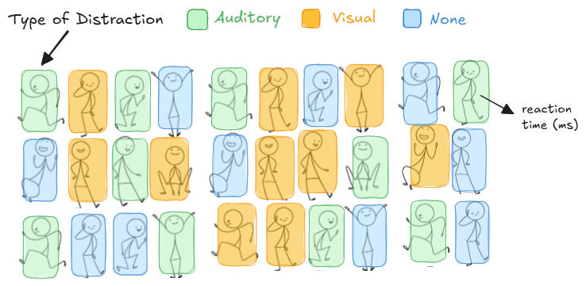
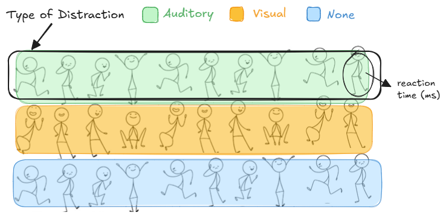

## Outline

-   Why experiments?
-   Sources of Variation
-   Basic Terminology
-   Design Blueprints
-   Example 1.1: Reaction Time

## Why Design of Experiments (DOE)?

*“If the design of an experiment is faulty, any method of interpretation which makes it out to be decisive must be faulty too.”* 

– Fisher, 1935, Design of Experiments

**Our Goal:** How to obtain useful data and work with it.

## Why Conduct Experiments?

-   To identify the main causes of variation in a measured response.
-   To determine the conditions that lead to maximum or minimum responses.
-   To compare responses at different settings of controllable variables.
-   To develop a mathematical model for predicting future responses.

## Sources of Variation (SV)

In any experiment, variation is inevitable and it can stem from:

-   differences in treatments
-   measurement errors
-   natural fluctuations in the environment.

Identifying and accounting for these sources is essential to ensure that the observed effects reflect real differences, not random noise.

## Example 1.1: Reaction Time

**Reaction time is the time taken to respond to a stimulus. Suppose we would like to study reaction time in human adults. We recruit 30 adults. Each participant sits at a computer and is instructed to press the space bar as quickly as possible when a visual stimulus (a green circle) appears on the screen. Reaction time (in milliseconds) is recorded for each participant.**

-   What are some possible sources of variability in the reaction times? That is, what might explain why reaction times in human adults differ from each other?

# Design Blueprints

## Treatment Structure vs Design Structure

-   **Treatment structure (Treatment Design):** Set of treatments, factors, treatment combinations, or populations that the experimenter has selected to study and/or compare - the "what" of the experiment.

-   **Design structure (Experimental Design):** Grouping of the experimental units into similar groups of blocks - the "how" of the experiment.

## Treatment Structures

| Structure Type    | Example Methods                                     |
|-------------------|-----------------------------------------------------|
| One-way           | One-way ANOVA, Simple Linear Regression             |
| Two-way and n-way | n-way ANOVA, Factorial Designs, Multiple Regression |

## Design Structures

| Structure Type | Example Methods |
|----|----|
| Completely Randomized | CRD |
| One-way Blocked | RCBD, BIBD, IBD |
| Two-way Blocked | Latin Square, Youden Square |
| Split Plot (Repeated Measures) | Split plot designs, repeated measures designs |

## Terminology

::: callout-note
-   **Factor:** An explanatory (or independent) variable to be studied in an investigation.

-   **Level:** A particular form of a factor.

-   **Treatment:** A treatment is determined by the set of factors and the levels of each factor.

-   **Response:** Something you measure during or after an investigation.

*NOTE: A factor HAS an effect on the response if different levels of the factor produce differing responses!*
:::

## Example 1.1: Reaction Time...

Now suppose that the experiment is conducted to determine what (if any) impact the type of distraction has on reaction time. Three different types of distraction (auditory, visual, and none) are used in the experiment. 

+ Factor(s):

+ Level(s):

+ Response(s):

+ A treatment corresponds to the levels.  Thus, this experiment has 3 treatments which are...

## Replication

::: callout-note
The number of replications in an experiment is the number of experimental units per treatment or treatment combination.  An experiment is said to be replicated if each treatment is applied *independently* to each of two or more experimental units.

+ **Experimental Unit (e.u.):** The smallest unit of experimental material to which a treatment is independently assigned.

+ **Measurement Unit (m.u.):** The *unit* at which the response is measured (aka: **sampling unit**). This may involve subsampling within an experimental unit.

+ **Experimental Error:** Differences that occur from one repetition (or replication) of an experiment to another.

NOTE: Replication makes it possible to estimate the variance of the experimental error.
:::

## Example 1.1: Reaction times...

Additional information: Each individual completes one task under their assigned distraction condition.

+	Identify the experimental unit (e.u.)

+	Measurement/Sampling unit (m.u.):

+	How many replications exist per treatment? r = _______

## Design Blueprint

```{r}

```

## 

+ **Treatment structure:** One-way treatment structure with 3 levels of distraction type (auditory, visual, and none) making up the 3 treatments.

+ **Experimental structure:** Distraction type is assigned to each individual (e.u.) in a completely randomized design (CRD) with r = 10. The reaction time (ms) is measured on each individual (m.u.).

## Example 1.1: Reaction time...

Additional information: Now suppose the researchers want to increase their sample size by having each of the 30 individuals repeat their task 5 times under their assigned distraction condition, resulting in 150 reaction times.

+ Identify the experimental unit:

+ Measurement unit:

+ How many replications exist per treatment?

## Subsampling

::: callout-note
**Subsampling** – taking multiple measurement units from the same experimental unit.

Treating these measurements as *independent* inflates the sample size, leading to overoptimistic results and increased type I errors.

It is best practice to aggregate subsamples (e.g., average) to get one response per experimental unit and ensure the analysis reflects the true number of experimental units.
:::

## Example 1.1: Reaction time...

Now suppose that instead of assigning distraction types individually, we place 10 individuals in a room at a time and apply the same distraction type to the entire group. This process is repeated three times – once for each distraction type.

+ Identify the experimental unit:

+ Measurement unit:

+ How many replications exist per treatment?

##

```{r}

```

## Unreplicated Designs

::: callout-warning
Unreplicated Designs – a study design with experimental unit replication of r = 1 causes issues since we cannot estimate the experimental error.
:::


<!-- ## Basic Steps -->

<!-- 1. Define the objectives of the experiment -->

<!-- 2. Identify the treatment factor and its levels -->

<!-- 3. Determine the number of observations per treatment (replications) -->

<!-- 4. Define the experimental units -->

<!-- 5. Describe how treatments will be applied to experimental units -->

<!-- 6. Explain how the response variable will be measured -->

<!-- 7. Outline the statistical analysis plan. -->

<!-- 8. Describe the interpretation of results. -->
