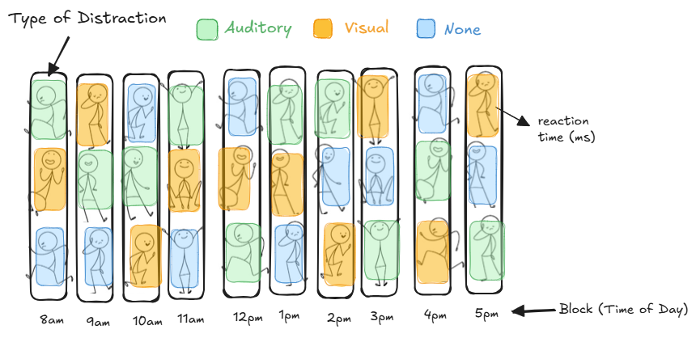

## Outline

-   Example 1.1: Reaction Time
-   Controlling for Variability
-   Randomization

## Control for Variability

This concept refers to actions that researchers take to reduce experimental error. There are several ways for a researcher to control experimental error:

+ Inclusion Criteria
+ Direct Control
+ Blocking

## Example 1.1: Reaction Time

Reaction time is the time taken to respond to a stimulus. Suppose we would like to study reaction time in human adults. We recruit 30 adults. Each participant sits at a computer and is instructed to press the space bar as quickly as possible when a visual stimulus (a green circle) appears on the screen. Reaction time (in milliseconds) is recorded for each participant.

Researchers conducted an experiment to determine what (if any) impact the type of distraction has on reaction time. Three different types of distraction (auditory, visual, and none) are used in the experiment.

## Inclusion Criteria

::: callout-note
**Inclusion Criteria:** The ________________________________ participants must have in order to qualify to be in a study. 

Having strict inclusion criteria creates a more homogeneous group of study participants than if the inclusion criteria were less strict. Having a more homogeneous group of study participants means less variability in the response variable.

:::

## Example 1.1: Reaction Time...

Suppose we want to study reaction time across a wide age range (18–65).

+ How might including both younger and older adults introduce variability into reaction times?

+ How could narrowing the inclusion criteria to ages 18–25 reduce variability in the results?

While stricter criteria may reduce variability, it could limit the generalizability of the findings.


## Direct Control

::: callout-note
**Direct Control:** This refers to holding certain variables or characteristics during data collection _________________ across all treatment groups to reduce variability that could be caused by factors unrelated to the explanatory variable.

When a researcher suspects that a specific variable (other than the explanatory variable) could influence the response, they may choose to keep it the same for all participants. This helps isolate the effect of the explanatory variable by reducing variation in the response caused by other factors.
:::

## Example 1.1: Reaction Time...

Suppose we want to study reaction time in response to different types of distractions.

+ How could background noise or lighting conditions influence the results?

+ What are some things we could hold constant to reduce variability not related to the distractions?

+ What might be the downsides of holding too many things constant? Could this make the study less realistic or applicable to real-world settings?


## Blocking

::: callout-note
**Blocking:** Experimental units are _______________ in such a way that the variability of the units within the blocks is less than the variability of the units across the blocks.  

The blocks should be similar in ways that are expected to affect the response to the treatment.  This allows for the treatments to be compared within a more uniform environment, and the variability associated with differences among the blocks can be separated from the experimental error.
:::

NOTE: We will examine the concept of blocking in much more detail later in the semester.

## Example 1.1: Reaction Time...

Suppose that, due to material constraints, only 3 participants can complete the study in any given hour. Each hour therefore forms a block.

To reduce set-up time, the researcher assigns all three participants tested during the same hour to receive the same distraction type.

+ Why is this a problem if reaction time may depend on time of day?
+ What would be a better way to assign distraction types within each hour?

## Randomized Complete Block Design (RCBD)

```{r}

```

# Randomization

## Randomization

::: callout-note
**Randomization** is the process of _________________________ to experimental units using a random mechanism. This ensures that every unit has an equal chance of receiving any treatment, preventing systematic bias.

**BIG IDEA:** Randomization eliminates the influence of hidden or unknown factors (often called extraneous variables) not under the direct control of the researcher so that comparisons between treatments measure only the true treatment effects. Without randomization, extraneous variables could confound the results, leading to misleading conclusions.

Think of randomization as insurance – protecting your experiment from unknown biases, just as insurance shields you from unforeseen risks.
:::

## Example 1.1: Reaction Times...

Suppose the first ten participants to sign up are assigned to the "no distraction" group, the next ten to the "visual distraction" group, and the final ten to the "auditory distraction" group.

Now, suppose that early sign-ups tend to be more motivated or well-rested, while later sign-ups are more fatigued or distracted by other commitments. As a result, differences in reaction times between groups could reflect not just the type of distraction but also differences in motivation or fatigue.

Why is this problematic?

## Randomized Experiment vs Observational Study

::: callout-note
+ **Randomized Experiment:** A treatment is __________________ and randomly imposed on an experimental unit in the interest of observing the response.

+ **Observational Study:** This involves collecting and analyzing data __________________ randomly assigning treatments to experimental units.

BIG IDEA: Because randomized experiments use random assignment of the treatments (as well as other types of randomization) cause-and-effect conclusions may be made. In observational studies, because no random assignment is used, only associations may be concluded, because there are likely to be confounding variables.
:::

## Complicating the dichotomy...

- Causal conclusions can be drawn from a couple different types of **well-designed** studies:
  - Randomized experiments
  - Quasi-experiments
  - Specifically designed and analyzed observational studies
  
- The key issue is whether you can convince yourself (an others) that confounding has been eliminated through your design and analysis

<!-- ## Basic Steps -->

<!-- 1. Define the objectives of the experiment -->

<!-- 2. Identify the treatment factor and its levels -->

<!-- 3. Determine the number of observations per treatment (replications) -->

<!-- 4. Define the experimental units -->

<!-- 5. Describe how treatments will be applied to experimental units -->

<!-- 6. Explain how the response variable will be measured -->

<!-- 7. Outline the statistical analysis plan. -->

<!-- 8. Describe the interpretation of results. -->
