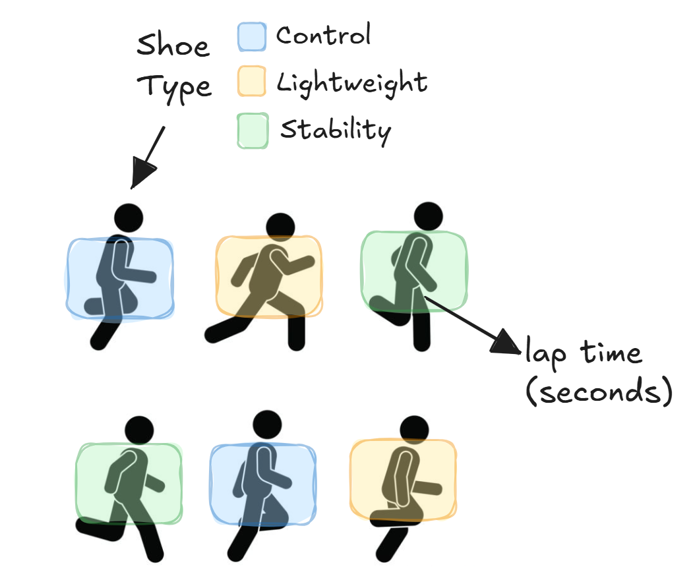
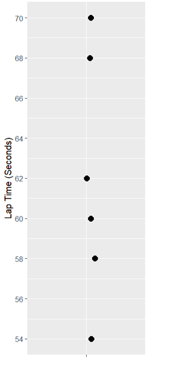
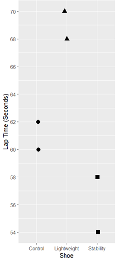
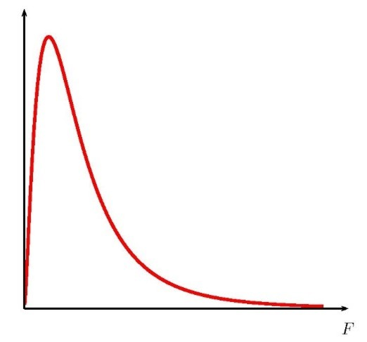
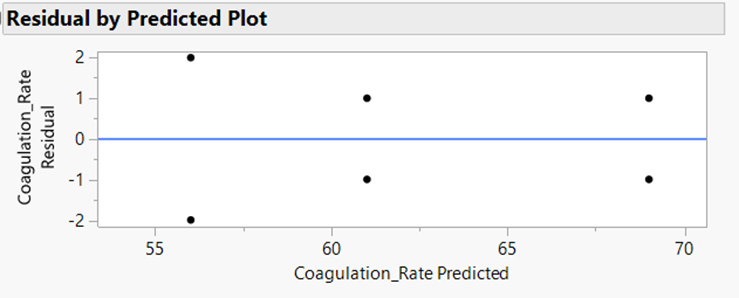
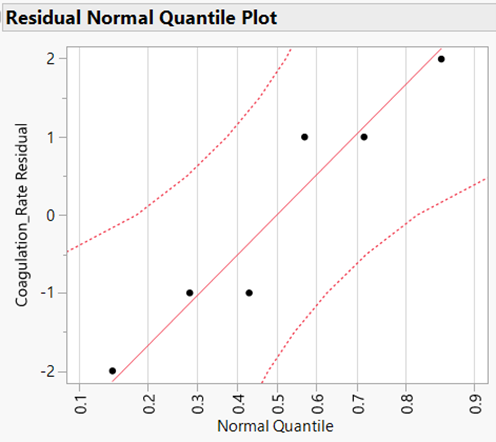
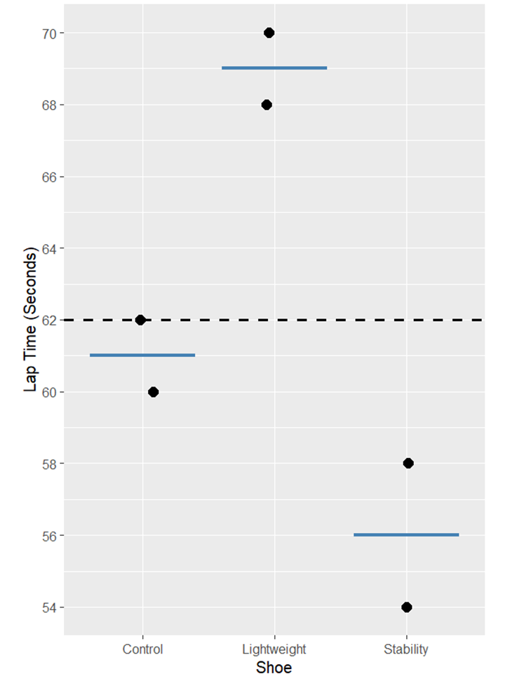
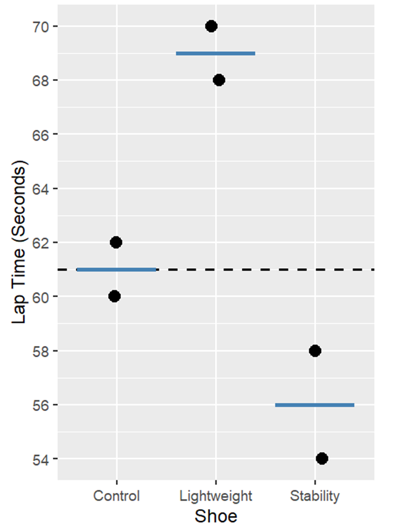

# Designing a CRD

## Completely Randomized Design (CRD)

+ The simplest experimental design
+ Treatments are assigned to experimental units **completely at random**

:::callout-note
## Definition: Complete Randomization (Balanced)

Let there be $N$ experimental units and $t$ treatments. Assume a **balanced** design, where the same number of experimental units are assigned each treatment, so $r = \frac{N}{t}$. In other words, $r$ units receive each treatment.

In **complete randomization** all possible arrangements of  the $N$ experimental units into $t$ groups of size $r$ are equally likely. 


:::

## What Makes a Design a CRD?

+ No blocking or grouping  
+ Random assignment only  

All unexplained variability goes into the **experimental error**

## When Is a CRD Appropriate?

A CRD works best when:

+ Experimental units are relatively homogeneous  
+ The experiment is small  
+ Few extraneous variables are present

## Advantages of a CRD

+ Very flexible  
+ Unequal sample sizes allowed  
+ Analysis remains straightforward  
+ Missing data is not catastrophic

## Disadvantages of a CRD

+ Sensitive to heterogeneity  
+ Larger experimental error when experimental units differ

## Example 2.1: Running Shoes

An experiment is conducted to investigate how different **running shoes** affect running performance (measured in seconds to complete a fixed route). We have three shoe types that we want to compare: *Control (regular trainers)*, *Lightweight shoes*, and *Stability shoes*. There are only 6 runners available for the experiment, so we will use two runners for each shoe type. The 6 runners gather at a track, and before beginning the trial they are each randomly assigned one shoe type. Each runner completes the same 400-meter route once, and their lap time is recorded.

## Example 2.1: Running Shoes (Blueprint)

```{r}
#| fig-align: center

```

## Example 2.1: Running Shoes

**Response:** Lap time (seconds)

**Treatment structure:** One-way treatment structure with 3 levels of shoe type (control, lightweight, and stability) making up the t=3 treatments.

**Experimental structure:** Shoe type is assigned to individuals (e.u.) in a CRD with r = 2 (N = 6). The lap time (seconds) is measured once for each individual (m.u.). 

## CRD Randomization in R - with `edibble` package

```{r}
#| include: false
set.seed(94)
```

:::: columns
::: {.column width="70%"}
```{r}
#| echo: true
#| results: hide

library(edibble)

crd_des <- design(name = "Shoe Type") |>
   set_units(runner = 6) |>                    
   set_trts(shoe_type = c("Control", 
                          "Lightweight", 
                          "Stability")
            ) |>  
   allot_trts(shoe_type ~ runner) |>                     
   assign_trts("random")

crd_table <- serve_table(crd_des)
crd_table
```
:::
::: {.column width="30%"}
```{r}
#| echo: false
crd_table
```
:::
::::


## CRD Randomization in R - by "hand"


```{r}
#| echo: true

# numer of experimental units
N <- 6
# number of replications (e.u.s per treatment)
r <- 2

# vector of treatment options/levels
treatments <- c("Control",
                "Lightweight",
                "Stability")

# vector of length N, repeating eaach treatment r times
treat_col <- rep(treatments, each = r)

treat_col
```


## CRD Randomization in R - by "hand"


:::: columns
::: {.column width="70%"}
```{r}
#| echo: true

crd_table2 <- data.frame(
  runner = paste0("runner", 1:N),
  shoe_type = sample(treat_col, 
                     size = N, 
                     replace = F))

```
:::
::: {.column width="30%"}
```{r}
#| echo: false
crd_table2
```

:::
::::

## CRD Randomization in R -- save design
:::: columns
::: {.column width="50%"}
```{r}
#| echo: true
#| results: hide
library(dplyr)

crd_table2 <- crd_table2 |> 
  mutate(laptime_s = NA)

crd_table2
```
:::
::: {.column width="50%"}
```{r}
#| echo: false
crd_table2
```
:::
::::

+ Alternatively, use `bind_cols()` to add the CRD assignment to an already existing data set.
+ Use `write_csv()` or `write_xlsx()` to export your design for data entry.


# Analyzing a CRD (ANOVA)

## From Design to Analysis


```{r}
#| include: false
library(tidyverse)
```

In a CRD, we assume:

+ The systematic source of variation comes from the treatments
+ All other variation is experimental error  

**Big idea:** Does accounting for treatment reduce unexplained variability by more than we would expect by chance?

## Example 2.1: Running Shoes

:::: columns
::: column
**Response:** Lap time (seconds)

**Treatment structure:** 

+ One-way
+ Factor: Shoe type 
+ 3 Levels: control, lightweight, and stability
+ t = 3
:::
::: column
**Experimental structure:** 

+ CRD
+ Experimental Unit: Individual (r = 2) 
+ Measurement Unit: Individual (N = 6)
:::
::::

**Goal:** Determine whether shoe type affects mean lap time.

## Example 2.1: Running Shoes (Blueprint)

```{r}
#| fig-align: center
#| out-height: "100%"

```

## Notation - $y_{ij}$

::: callout-note
Suppose that $y_{ij}$ represents the response value for the  $j^{th}$ observation taken under the $i^{th}$ treatment.  In general, we have $t$ treatments and $r$ observations under the $i^{th}$ treatment (number of replications).

+ $\bar y_{\cdot\cdot}$ -- overall mean
+ $\bar y_{i\cdot}$ -- treatment mean
:::

## Example 2.1: Running Shoes `02-shoes.csv`

Suppose the experiment was carried out, and the following lap times were recorded:

```{r}
#| echo: false
shoe_data <- read_csv("_data/02-shoes.csv") |> 
  janitor::clean_names() 
 
shoe_data |> 
  knitr::kable()
```

## Example 2.1: Running Shoes

:::: columns
::: {.column width="70%"}
Suppose shoe has **no effect**

+ All runners share the same mean lap time  
+ Differences are due to random variation

If we **ignore shoe type**, our best guess for any runner is the *overall average lap time*

$$\bar y_{\cdot\cdot} =$$

Error = observed - overall mean
:::
::: {.column width="30%"}
```{r}
#| out-width: "60%"

```
:::
::::

## Total Sum of Squares

:::: columns
::: {.column width="70%"}
Total variability measures how far observations are from the overall mean.

<div style="font-size: 80%;">
$$SST = \sum_{i=1}^t\sum_{j=1}^r(y_{ij}-\bar y_{\cdot\cdot})^2 = $$

$$(-2)^2+(0)^2+(6)^2+(8)^2+(-4)^2+(-8)^2=$$
</div>

:::
::: {.column width="30%"}
```{r}
#| out-width: "60%"

```
:::
::::

## Example 2.1: Running Shoes

:::: columns
::: {.column width="70%"}
Now suppose shoe *does* matter. If shoe has an effect:

+ Runners wearing the same shoe should have similar lap times
+ Different shoes may have different mean lap times

Best guess for a runner is the mean lap time for their shoe - $\bar y_{i\cdot}$

Error = observed - treatment mean
:::
::: {.column width="30%"}
```{r}
#| out-width: "60%"

```
:::
::::

## Sum of Squares Error (SSE)

:::: columns
::: {.column width="70%"}
This remaining variability is:

+ Variation *within* shoe types  
+ Experimental error 

<div style="font-size: 80%;">
$$SSE = \sum_{i=1}^t\sum_{j=1}^r(y_{ij}-\bar y_{i\cdot})^2 =$$

$$(-1)^2+(1)^2+(-1)^2+(1)^2(2)^2+(-2)^2=$$
</div>
:::
::: {.column width="30%"}
```{r}
#| out-width: "60%"

```
:::
::::

## Sum of Square Treatment (SSTrt or SSG)

**What did we gain?** By considering shoe total variability is reduced and the reduction is attributed to treatment.

<div style="font-size: 80%;">
$$SSTrt = SST - SSE = $$
</div>

Is this reduction in error big enough to claim shoe has an effect on lap time?

<div style="font-size: 80%;">
$$SSTrt = \sum_{i=1}^t\sum_{j=1}^r(\bar y_{i\cdot}-\bar y_{\cdot\cdot})^2=$$
$$2(61-62)^2+2(69-62)^2+2(56-62)^2 =$$
</div>

## Analysis of Variance (ANOVA)

Note that $SST = SSTrt + SSE$. Thus, we have partitioned the total sums of squares into two parts:

+ SSTrt: The variation between factor level means (*betweeen* treatments)
+ SSE: The variation due to experimental error (*within* treatments)

## ANOVA Table

| Source     | df    | SS    | MS                 | F          |
|------------|-------|-------|--------------------|------------|
| Treatments | t − 1 | SSTrt | MSTrt = SSTrt/(t−1) | MSTrt/MSE  |
| Error      | N − t | SSE   | MSE = SSE/(N−t)    |            |
| Total      | N − 1 | SST   |                    |            |

- **Large F**: treatment explains substantial variability  
- **F ≈ 1**: treatment explains little beyond noise

## Example 1.1: Running Shoes

| Source     | df                     | SS  | MS             | F             |
|------------|--------------|-----|----------------|---------------|
| Treatments | &nbsp;&nbsp; | 172 | 172 / 2 = 86   | 86 / 4 = 21.5 |
| Error      | &nbsp;&nbsp; | 12  | 12 / 3 = 4     |               |
| Total      | &nbsp;&nbsp; | 184 |                |               |


## Skeleton ANOVA (use context!)

:::: columns
::: column
```{r}
#| fig-align: center

```
:::
::: column
| SV                      | df                    |
|-------------------------|-----------------------|
| $\phantom{\text{Treatments}}$ | $\phantom{N-t\;\;\;\;}$ |

:::
::::
                       
## What ANOVA Answers:

Do **any** treatment means differ?

$$H_0: \mu_{Control}=\mu_{Lightweight}=\mu_{Stability}$$

$$H_A: \text{At least one } \mu_i \text{ differs}$$ 

## F-distribution (assuming the null is true)

:::: columns
::: {.column width="65%"}
- Large $F$ is evidence to reject $H_0$
- Under $H_0$: $F \sim F_{(t-1,\;N-t)}$
:::
::: {.column width="35%"}
```{r}
#| fig-align: center
#| out-width: 100%

```
:::
::::

## Analyzing a One-way ANOVA in R

```{r}
#| echo: true
shoe_mod <- lm(lap_time_seconds ~ shoe, data = shoe_data)
anova(shoe_mod)
```

## Example 2.1: Running Shoes (Conclusion)

At an $\alpha = 0.05$, we have evidence to conclude there is an effect of shoe type on lap time (seconds) for all runners similar to those in our study (F = 21.5; df = 2,3; p = 0.017).

**Alternative conclusion:** At an $\alpha = 0.05$, we have evidence to conclude the mean lap time (seconds) differs for at least one shoe type for all runners similar to those in our study (F = 21.5; df = 2,3; p = 0.017).


# Statistical Model for a CRD


## From ANOVA to a Statistical Model

ANOVA answers whether treatments differ.

A statistical model explains:

- Where variability comes from  
- How treatment effects are represented 
- What parameters/coefficients we estimate

## Modeling the Response

For a CRD, each observation can be written as:

$$y_{ij} = \text{systematic part} + \text{random error}$$

The model separates signal from noise.

## Example 2.1: Running Shoes

:::: columns
::: column
**Response:** Lap time (seconds)

**Treatment structure:** 

+ One-way
+ Factor: Shoe type 
+ 3 Levels: control, lightweight, and stability
+ t = 3
:::
::: column
**Experimental structure:** 

+ CRD
+ Experimental Unit: Individual (r = 2) 
+ Measurement Unit: Individual (N = 6)
:::
::::

**Goal:** Determine whether shoe type affects mean lap time.

## Example 2.1: Running Shoes (Blueprint)

```{r}
#| fig-align: center
#| out-height: "100%"

```

## Cell Means Model

$$y_{ij} = \mu_i + \varepsilon_{ij} \text{ with } \varepsilon_{ij} \text{ iid } \sim N(0, \sigma^2)$$
for 	$i = 1, 2, 3$ and $j = 1, 2$

Where:

+ $y_{ij}$ - the *observed* lap time for the $j^{th}$ runner wearing the $i^{th}$ shoe type.

+	$\mu_i$ - the mean lap time for runners wearing the $i^{th}$ shoe type.

+	$\epsilon_{ij}$ - the experimental error associated with the $j^{th}$ runner wearing the $i^{th}$ shoe type.

## Effects Model

$$y_{ij} = \mu + \tau_i + \varepsilon_{ij} \text{ with } \varepsilon_{ij} \text{ iid } \sim N(0, \sigma^2)$$
for 	$i = 1, 2, 3$ and $j = 1, 2$

Where:

+ $y_{ij}$ - the *observed* lap time for the $j^{th}$ runner wearing the $i^{th}$ shoe type.

+	$\mu$ - the overall mean lap time.

+ $\tau_i$ - the effect of the $i^{th}$ shoe type.

+	$\epsilon_{ij}$ - the experimental error associated with the $j^{th}$ runner wearing the $i^{th}$ shoe type.

## Assumptions: $\varepsilon_{ij} \text{ iid } \sim N(0, \sigma^2)$

We assume:

- Errors are independent and normally distributed *(iid ~ = identically and independently distributed)*
- Mean zero  
- Constant variance $\sigma^2$ (e.g., pooled t-test)

All ANOVA inference depends on these assumptions.

## Checking Model Assumptions: Constant Variance

**Type of Plot:** Look at the residuals vs fitted/predicted values

**Ideal Plot:** Equally spread in residuals across all treatments (e.g., horizontal band)

```{r}
#| out-width: 50%

```

## Checking Model Assumptions: Normality

**Type of Plot:** Normal probability plot of the residuals (QQ-plot)

**Ideal Plot:** Points fall close to the reference line

```{r}
#| out-width: 40%

```

## Estimating Model Parameters/Coefficients

**Recall:** $y_{ij} = \mu + \tau_i + \varepsilon_{ij} \text{ with } \varepsilon_{ij} \text{ iid } \sim N(0, \sigma^2)$

**Goal:** Use data to *estimate*:

+ $\mu$ (denoted $\hat \mu$),
+ $\tau$ (denoted $\hat \tau$), and
+ $\sigma^2$ (denoted $\hat \sigma^2$)

Then we can make predictions/estimates with $\hat y_i = \hat \mu + \hat \tau_i$.

## Identifiability Problem

The model parameters are not unique unless we add a constraint.

**Solutions:** Impose a constraint on $\tau_i$

+ Sum to zero (JMP default) *what we will use in this class*
+ Set to zero (R default) *need to change R settings when analyzing data*

## Sum to Zero

:::: columns
::: {.column width=60%}
Constraint: $\sum_i^t \tau_i = 0$

<div style="font-size: 70%;">
+ $\hat{\mu} =$ _______ (overall mean)
+ $\hat{\tau}_1 =$ _______ (deviation of trt mean from overall mean)
+ $\hat{\tau}_2 =$ _______
+ $\hat{\tau}_3 =$ _______

Then:

+ $\hat{\mu}_1 =$ _______
+ $\hat{\mu}_2 =$ _______
+ $\hat{\mu}_3 =$ _______
</div>
:::
::: {.column width=40%}
```{r}
#| out-width: 80%

```
:::
::::

## Set to Zero

:::: columns
::: {.column width=60%}
Constraint: Set $\tau_1 = 0$ (or another reference level, e.g. $\tau_3=0$)

<div style="font-size: 70%;">
+ $\hat{\mu} =$ _______ (mean of reference level, e.g. $\hat \mu_1$)
+ $\hat{\tau}_1 =$ _______ (deviation of trt mean from mean of reference level)
+ $\hat{\tau}_2 =$ _______
+ $\hat{\tau}_3 =$ _______

Then:

+ $\hat{\mu}_1 =$ _______
+ $\hat{\mu}_2 =$ _______
+ $\hat{\mu}_3 =$ _______
</div>
:::
::: {.column width=40%}
```{r}
#| out-width: 80%

```
:::
::::

## R (set to zero): Estimating Parameters

```{r}
#| echo: true
shoe_mod <- lm(lap_time_seconds ~ shoe, data = shoe_data)
summary(shoe_mod)
```

## R (sum to zero): Estimating Parameters {.scrollable}


⚠️⚠️⚠️Change settings in R to "sum to zero"⚠️⚠️⚠️


```{r}
#| code-line-numbers: "2"
#| echo: true

# change options for sum to 0
options(contrasts = c("contr.sum", "contr.poly"))

shoe_mod <- lm(lap_time_seconds ~ shoe, data = shoe_data)
summary(shoe_mod)
```

```{r}
#| echo: true

# change options back to R default
options(contrasts = c("contr.treatment", "contr.poly"))
```


## R: Estimating $\hat{\sigma}^2$

```{r}
#| echo: true
options(contrasts = c("contr.sum", "contr.poly"))
shoe_mod <- lm(lap_time_seconds ~ shoe, data = shoe_data)
anova(shoe_mod)
```

