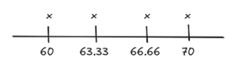
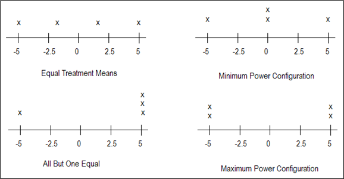

## Motivation

We haven't yet answered... How much data should we collect?

## Outcomes of hypothesis testing

|   | $H_0$ is True | $H_0$ is False |
|------------------------|------------------------|------------------------|
| **Reject** $H_0$ | Type I ( \_\_\_\_\_\_\_\_\_\_\_) | No Error ( \_\_\_\_\_\_\_\_\_\_\_) |
| **Fail to Reject** $H_0$ | No Error ( \_\_\_\_\_\_\_\_\_\_\_) | Type II ( \_\_\_\_\_\_\_\_\_\_\_) |

## What power means

::: callout-note
### Power $(1 - \beta)$

The **power** of a test is the probability of correctly rejecting the null hypothesis if a particular alternative scenario is true.
:::

$\text{Power} = 1-\beta = P(\text{reject } H_0 \mid \text{a meaningful difference does in fact exist})$

## Why $\beta$ is harder to find than $\alpha$

Power depends on:

-   Variability ($\sigma^2$)
-   Sample size (replications)
-   Design choices

**A key idea:** You cannot compute power for “something differs”

::: notes
There are infinitely many alternatives. Power must be computed for a *specific* alternative.
:::

## Example 3.1: Shoe Type (extended)

Suppose, we are preparing to conduct a study for:

-   $t = 4$ shoe types
-   $r = 3$ runners per shoe
-   CRD randomization

## Meaningful difference

$\delta$ = difference worth detecting

-   Example: Fastest vs slowest shoe differs by **10 seconds**

::: notes
This is a scientific or practical decision, not a statistical one.
:::

## What we must specify

::: callout-note
### Information Needed to Calculate the Power of a Test

1. a specific alternative (e.g., $\delta$)
2. replications per treatment ($r$)
3. variability estimate ($\sigma^2$)
4. significance level ($\alpha$)
:::

## Reminder: the ANOVA test

$$F = \dfrac{\text{MSTrt}}{\text{MSE}}$$

+ **If** $H_0$ is true, $F \sim F(\text{df}_1,\text{df}_2)$ (Central $F$)

+ **If a specific** $H_A$ is true $F \sim F(\text{df}_1,\text{df}_2,\lambda)$ (Noncentral $F$)

## Degrees of freedom (CRD)

If we have $t$ treatments and $r$ reps each:

-   $\text{df}_1 = t - 1$
-   $\text{df}_2 = t(r - 1)$

::: callout-note
## Example 3.1: Skeleton ANOVA

| SV                          | DF: 12 runners - 1 = 11 total |
|-----------------------------|-------------------------------|
| Shoe Type                   | (4 - 1) = 3                   |
| Runner(Shoe Type) –\> error | (3 - 1)(4) = 8                |
:::

## The noncentrality parameter

$$\lambda = \frac{\sum_{i=1}^{t}(\mu_i-\mu)^2}{\sigma^2 / r}$$

+ _____ = the mean of the $i^{th}$ treatment group
+ _____ = the overall mean
+ _____ = the experimental error variance
+ _____ = the number of replications of the $i^{th}$ treatment group


::: callout-note
## Sanity check

If all means are equal, then $\lambda = 0$.
:::

## Example 3.1: Shoe Type

Recall, the things we need to calculate power are:

**1. A specific alternative (e.g., $\delta$)**

An ultra-marathon running expert tells us that if there is a difference of 10 seconds between the runners lap times, then that would be of practical importance. Thus, $\delta = 10$.

```{r}
#| fig-align: center
#| out-width: 30%
#| echo: false

```

## Example 3.1: Shoe Type

Recall, the things we need to calculate power are:

**2. Replications per treatment ($r$)**

We are conducting a study with $t = 4$ and $r = 3.$

## Example 3.1: Shoe Type

Recall, the things we need to calculate power are:

**3. variability estimate ($\sigma^2$)**

From an analysis of a pilot study (from Mod 2: CRD Notes), we found $\hat\sigma^2 = 17.46$

::: callout-note
### Pilot Studies
Pilot Studies can be super helpful for estimating experimental error variance $(\hat\sigma^2)$ and
differences in group means – key pieces of a power analysis. Running a small version of your
experiment gives you data to calculate the mean square error and get a sense of the effect
size. This makes it easier to plan the full study and ensure your design has enough power to
detect meaningful differences.
:::

## Example 3.1: Shoe Type

Recall, the things we need to calculate power are:

**4. Significance level ($\alpha$)**

We get to set this at $\alpha = 0.05.$

# Power as area


```{r}
# -----------------------------------------
# f dist plot -----------------------------
# -----------------------------------------
library(tidyverse)

# setup ______________
t   <- 4
r   <- 3
sigma2 <- 17.46
delta  <- 10
# ______________________

# Define the degrees of freedom and noncentrality parameter
df1 <- t-1
df2 <- (r-1)*t
ncp <- (((delta/2)^2 + (-((delta/2) - (delta)/3))^2 + ((delta/2) - (delta)/3)^2 + (delta/2)^2))/(sigma2/r)

# Create a data frame for the F-distribution
x <- seq(0, 20, length.out = 1000)
y <- df(x, df1, df2)
data <- data.frame(x = x, y = y)

# Find the critical value for the top 5%
critical_value <- qf(0.95, df1, df2)

# Create a data frame for the F-distribution
x <- seq(0, 20, length.out = 1000)
y <- df(x, df1, df2)
data <- data.frame(x = x, y = y)

# Create a data frame for the shaded region (top 5%)
shade_data <- data[data$x >= critical_value, ]

# noncentral F

# Find the critical value for the top 5% of the central F-distribution
critical_value <- qf(0.95, df1, df2)
power <- pf(critical_value, df1, df2, ncp, lower.tail = F)
# power

# Create a data frame for the central F-distribution
x <- seq(0, 20, length.out = 1000)
y_central <- df(x, df1, df2)
data_central <- data.frame(x = x, y = y_central)

# Create a data frame for the noncentral F-distribution
y_noncentral <- df(x, df1, df2, ncp = ncp)
data_noncentral <- data.frame(x = x, y = y_noncentral)

# Create a data frame for the shaded region (top 5%)
shade_data <- data_central[data_central$x >= critical_value, ]
shade_data2 <- data_noncentral[data_noncentral$x >= critical_value, ]

# ----------------

# Plot both distributions and shade the top 5%
plot_central_f <- ggplot() +
  geom_line(data = data_central, aes(x = x, y = y), color = "steelblue", size = 1, linetype = "solid") +
  labs(title = "Central F-Distributions",
       subtitle = sprintf("Central: df1 = %d, df2 = %d", df1, df2),
       x = "F value",
       y = "Density") +
  scale_x_continuous(limits = c(0,15)) +
  scale_y_continuous(limits = c(0,0.75)) +
  theme_minimal() +
  theme(plot.title = element_text(hjust = 0.5),
        plot.subtitle = element_text(hjust = 0.5),
        aspect.ratio = 1) +
  # Add legend
  scale_color_manual(name = "Distributions", 
                     values = c("Central F" = "blue", "Noncentral F" = "green"),
                     labels = c("Central F (solid)", "Noncentral F (dashed)"))

# -----------

# Plot both distributions and shade the top 5%
plot_central_f_rr <- ggplot() +
  # Central F-distribution
  geom_line(data = data_central, aes(x = x, y = y), color = "steelblue", size = 1, linetype = "solid") +
  # Noncentral F-distribution
  # geom_line(data = data_noncentral, aes(x = x, y = y), color = "orange3", size = 1, linetype = "solid") +
  # Shaded area for the central F-distribution's top 5%
  geom_area(data = shade_data, aes(x = x, y = y), fill = "steelblue", alpha = 0.5) +
  # geom_area(data = shade_data2, aes(x = x, y = y), fill = "orange3", alpha = 0.5) +
  # Critical value line
  geom_vline(xintercept = critical_value, linetype = "dashed", color = "black") +
  # Label the critical value
  annotate("text", x = critical_value + 0.2, y = max(y_central) / 2, 
           label = sprintf("Critical value = %.2f", critical_value), 
           hjust = 0, color = "black") +
  # Label the area
  # annotate("text", x = critical_value + 0.3, y = max(y_noncentral) + 0.1,
           # label = sprintf("Power = %.3f", power),
           # hjust = 0, color = "orange3") +
  # Titles and labels
  labs(title = "Central F-Distributions",
       subtitle = sprintf("Central: df1 = %d, df2 = %d", df1, df2),
       x = "F value",
       y = "Density") +
  scale_x_continuous(limits = c(0,15)) +
  scale_y_continuous(limits = c(0,0.75)) +
  theme_minimal() +
  theme(plot.title = element_text(hjust = 0.5),
        plot.subtitle = element_text(hjust = 0.5),
        aspect.ratio = 1) +
  # Add legend
  scale_color_manual(name = "Distributions", 
                     values = c("Central F" = "blue", "Noncentral F" = "green"),
                     labels = c("Central F (solid)", "Noncentral F (dashed)"))


# -----------

# Plot both distributions and shade the top 5%
plot_noncentral_f <- ggplot() +
  # Central F-distribution
  geom_line(data = data_central, aes(x = x, y = y), color = "steelblue", size = 1, linetype = "solid") +
  # Noncentral F-distribution
  geom_line(data = data_noncentral, aes(x = x, y = y), color = "orange3", size = 1, linetype = "solid") +
  # Shaded area for the central F-distribution's top 5%
  geom_area(data = shade_data, aes(x = x, y = y), fill = "steelblue", alpha = 0.5) +
  geom_area(data = shade_data2, aes(x = x, y = y), fill = "orange3", alpha = 0.5) +
  # Critical value line
  geom_vline(xintercept = critical_value, linetype = "dashed", color = "black") +
  # Label the critical value
  annotate("text", x = critical_value + 0.2, y = max(y_central) / 2, 
           label = sprintf("Critical value = %.2f", critical_value), 
           hjust = 0, color = "black") +
  # Label the area
  annotate("text", x = critical_value + 0.3, y = max(y_noncentral) + 0.1,
           label = sprintf("Power = %.3f", power),
           hjust = 0, color = "orange3") +
  # Titles and labels
  labs(title = "Central and Noncentral F-Distributions",
       subtitle = sprintf("Central: df1 = %d, df2 = %d | Noncentrality Parameter = %.2f ||| sigma2 = %.2f and delta = %d", df1, df2, ncp, sigma2, delta),
       x = "F value",
       y = "Density") +
  scale_x_continuous(limits = c(0,15)) +
  scale_y_continuous(limits = c(0,0.75)) +
  theme_minimal() +
  theme(plot.title = element_text(hjust = 0.5),
        plot.subtitle = element_text(hjust = 0.5),
        aspect.ratio = 1) +
  # Add legend
  scale_color_manual(name = "Distributions", 
                     values = c("Central F" = "blue", "Noncentral F" = "green"),
                     labels = c("Central F (solid)", "Noncentral F (dashed)"))

```

## Power as an area

:::: columns
::: column
Consider the central F-distribution with these parameters:
:::
::: column
```{r}
#| fig-align: center
#| out-width: 90%
#| fig-width: 5
#| fig-height: 5
plot_central_f
```
:::
::::

## Power as area

:::: columns
::: column
Recall, that the power represents the probability of **rejecting the null** when a specific alternative is true.  So let’s focus on the region where we’ll reject the null hypothesis (the Rejection Region)
:::
::: column
```{r}
#| fig-align: center
#| out-width: 90%
#| fig-width: 5
#| fig-height: 5
plot_central_f_rr
```
:::
::::

## Power as area
:::: columns
::: column
Now, we must incorporate the part about the **specific alternative being true**. If our particular alternative is true, then the F-statistic actually follows a non-central F-distribution with the aforementioned parameters. This is plotted on the same plot as the central F-distribution below here.

:::callout-tip
Play around with this visualization at [this nifty applet](https://smzr97-test0student-ear.shinyapps.io/power-explorer-323/) that Dr. Robinson made!
:::

:::
::: column
```{r}
#| fig-align: center
#| out-width: 90%
#| fig-width: 5
#| fig-height: 5
plot_noncentral_f
```
:::
::::

The power for this test is about ________.  That is, there is only a 51% chance of correctly rejecting the null hypothesis under these conditions.  Do you think this is a good test?

## Ideal Power

For most experiments, we would like the power of the test to be at least __________.

## Power Configurations

Even with the same max difference $\delta$...

```{r}
#| fig-align: center
#| out-width: 60%
#| echo: false

```

## Power depends on the configuration

| Mean pattern      | Power (approx.) |
|-------------------|----------------:|
| Maximum power     |            0.78 |
| **Minimum power** |        **0.47** |
| Equally spaced    |            0.51 |
| All but one equal |            0.65 |


## Power in R with `pwr2` package {.scrollable}

```{r}
#| echo: true
#| code-fold: true

# Install pwr2 this special way
pak::pak("cran/pwr2")
library(pwr2)
```


:::: columns
::: column
What is the the power of my test?


```{r}
#| echo: true
pwr.1way(
  k = 4,              # Number of groups
  n = 3,              # Sample size per group
  alpha = 0.05,       # Significance level
  delta = 10,         # Difference in group means
  sigma = sqrt(17.46) # Standard deviation of obs
)
```
:::
::: column
What is the sample size I need?

```{r}
#| echo: true
ss.1way(
  k = 4,               # Number of groups
  alpha = 0.05,        # Significance level
  beta = 1 - 0.80,     # Type II error rate (1 - power)
  delta = 10,          # Difference in group means
  sigma = sqrt(17.46), # Standard deviation of obs
  B = 100              # Number of iterations for numerical search
)
```
:::
::::

