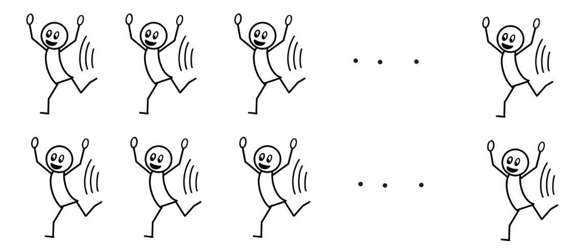
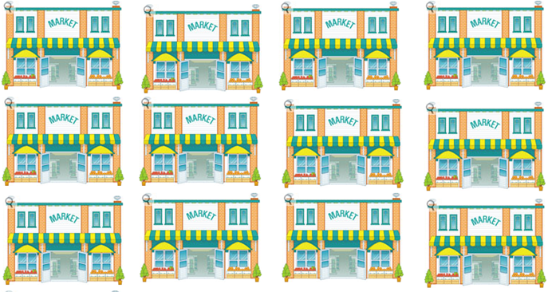

# Why Factorials?: Treatment vs Design Structure

## Recall One-way Treatment Structures

**One Factor at a Time**

+ Multiple levels -> $t$ treatments
+ Compare the mean response between the treatments

**What are we missing?**

+ Effects may depend on context
+ Optimal choice may change depending on that context
+ One factor doesn't always tell the full story

## Example 4.1: Blood Pressure

> Incidence of high blood pressure in the United States continues to rise, and optimal strategies for treatment remain an open question. Most physicians agree that effective treatment likely involves a combination of lifestyle changes and medication, rather than relying on a single approach.
>
> Researchers plan to study middle-aged U.S. women with moderate hypertension who are otherwise healthy (i.e., eating a standard diet and not taking regular medications).
> 
> **Goal:** Identify optimal combinations of diet and medication for lowering and maintaining blood pressure as measured by the change in blood pressure (mmHg) for each participant.

## Example 4.1: Blood Pressure

:::: columns
::: column
**Diet** *(2 levels):*

+ Mediterranean diet (low sodium, low fat)
+ Standard American diet
:::
::: column
**Medication** *(4 levels):*

+ Diuretic (D): flushes excess water and salt
+ ACE inhibitor: widens blood vessels
+ Beta blocker (BB): reduces heart and vessel signaling
+ Placebo (P)
:::
::::

> 200 volunteers who meet the study inclusion criteria are recruited.

## Study Design A (A common first attempt)

:::: columns
::: column
+ First, 100 participants are randomly assigned to one of two diets
(50 Mediterranean, 50 Standard American).
+ Separately, 100 participants are randomly assigned to one of four medications
(25 per medication).
:::
::: column
```{r}
#| fig-align: center
#| out-width: 80%


```
```{r}
#| fig-align: center
#| out-width: 80%


```
:::
::::

## Study Design A (A common first attempt)

Researchers then find:

1. The Mediterranean diet lowers blood pressure, on average.
2. ACE inhibitors lower blood pressure more than other medications, on average.

Is the optimal strategy to recommend the Mediterranean diet and ACE inhibitors together?


## Study Design B (A full factorial)

Each participant is randomly assigned to one **combination** of:

:::: columns
::: column
+ Diet (2 levels)
+ Medication (4 levels)
:::
::: column
```{r}
#| fig-align: center
#| out-width: 70%


```
:::
::::

This results in t = _____ treatment combinations, with r = _____ participants per combination.

What can we learn from Design B that we can't from Design A?

## Full Factorial $(a \times b\times c \times ...)$

::: callout-note
### Definition: Full Factorial $(a \times b\times c \times ...)$

A **full factorial treatment structure** (e.g., 2x2x2, 3x2 or 2x2, etc.) is a study in which there are two or more factors. Each factor will have at least two levels. The factor levels are combined to create the treatments (or treatment combinations).
:::

**Example:** 2 diets x 4 medications

+ _____ x _______ full factorial

**Example (Extended):** 2 diets x 4 medications x 2 exercise routines

+ _____ x _______ x _______ full factorial

## Treatment Structure for a Full Factorial

+ Name: 
+ Factors: 
+ Levels:
+ t = _____ with Treatments: 

*A 2 x 4 full factorial with factors Diet (2 levels - Standard American, Mediterranean) and Medication (4 levels - Diuretic, ACE inhibitor, Beta blocker, and Placebo) for a total of t = 8 treatment combinations (e.g., Standard American x Diuretic, Standard American x ACE, ..., Mediterranean x Placebo).*

## Experimental Structure for a Full Factorial

+ Name:
+ Experimental units: r = _____
+ Measurement unit:

*Diet and Medication treatment combinations are assigned to middle-aged U.S. women with moderate hypertension who are otherwise healthy (e.u.) in a CRD with r = 25. The change in blood pressure (mmHg) is measured for each woman in the study (m.u.).*

## Create a Full Factorial CRD in R with `edible` package

```{r}
#| echo: true
#| output-location: column
library(edibble)
library(tidyverse)

des <- design(name = "BP 2 x 4 Full Facotrial CRD") |> 
  set_units(indv = 200) |>                  
  set_trts(Diet = c("Standard American", 
                    "Mediterranean"),
           Medication = c("Diuretic", 
                          "ACE", 
                          "Beta blocker", 
                          "Placebo")
           ) |> 
  allot_trts(Diet*Medication ~ indv) |>                
  assign_trts("random")  

factorial_table <- serve_table(des)
factorial_table$change_bp <- NA

head(factorial_table)
```
## Create a Full Factorial CRD in R "by hand": Step 1
:::columns

:::column
```{r}
#| echo: true

# number of replications (e.u.s per treatment)
r <- 25

# vector of factor levels for first factor
diets <- c("Standard American", "Mediterranean")

# vector of factor levels for second factor
medications <- c("Diuretic", "ACE", 
                 "Beta blocker", "Placebo")

# create a dataset with t rows -- 
# one for every treatment combo
treats <- crossing(diets, medications) |> 
  unite(col = treatment, everything(), 
        remove = F, sep = " + ") # create a new treatment column
```
:::

:::column
```{r}
#| echo: false

treats |> 
  knitr::kable() |>
  kableExtra::kable_styling(font_size = 20)
```

:::
:::
## Create a Full Factorial CRD in R "by hand": Step 2

```{r}
#| echo: true

bp_factorial_design <- treats |> 
  slice(rep(1:n(), each = r)) |>  #repeat each treatment r times
  mutate(rand = sample(1:n(), n(), 
                       replace = F)) |>  # random permute
  arrange(rand) |> 
  mutate(indv = str_c("indv_",rand), .before = treatment) |> #create id var
  mutate(change_bp = NA) |>  # create blank variable for data entry
  select(-rand) # clean up columns
```
```{r}
#| echo: true
#| eval: false

head(bp_factorial_design, n = 20)
```

```{r}
#| echo: false

bp_factorial_design |> 
  head(n = 20) |> 
  knitr::kable() |> 
  kableExtra::scroll_box(height = "200px") |> 
  kableExtra::kable_styling(font_size = 25)
```


# Factorial Contrasts: Main, Simple, and Interaction Effects

## Example 4.2: Bakery

> A bakery supplied Italian bread to a large number of supermarkets in a metropolitan area. An experiment was conducted to investigate the effects of the height of the shelf display (bottom, middle, or top) and the width of the shelf display (regular vs. wide) on the sales of this bakery’s bread. Twelve supermarkets, similar in terms of sales volume and clientele, were used in this study. The six treatment combinations were assigned at random to two stores, each according to a completely randomized design.

```{r}
bakery_data <- read_csv("_data/04-bakery_data.csv")
```

## Study Design

:::: columns
::: column
**Treatment Structure**

[ A 3 x 2 full factorial with factors Shelf Height (3 levels - Bottom, Middle, Top) and Shelf Width (2 levels - Regular, Wide) for a total of t = 6 treatment combinations. ]{style="font-size:0.85em"}

**Design Structure**

[ Shelf height and width treatment combinations are assigned to supermarket stores (e.u.) in a CRD with r = 2. The sales (number of bakery's bread) are measured for each supermarket store (m.u.). ]{style="font-size:0.85em"}
:::

::: column
```{r}
#| fig-align: center
#| out-width: 90%

```
:::
::::

## Notation -- $y_{ijk}$

::: callout-note
Since we added a factor, we add an index to denote our observations. Let $y_{ijk}$ denote the observed response for the $k^{th}$ experimental unit given the $i^{th}$ level of Factor A and the $j^{th}$ level of Factor B.
:::

**Example 4.2:** $y_{ijk}$ denotes the observed number of bread sales at the $k^{th}$ supermarket store given the $i^{th}$ shelf height and $j^{th}$ shelf width.

```{=html}
<style>
.reveal .slides .small table { font-size: 0.78em; line-height:1.05; }
.reveal .slides .small table th, .reveal .slides .small table td { padding:6px 8px; }
</style>
```

## Mean sales for each treatment combination {.small}

+-------------------------------------------------------------------+----------------------------------------------------+----------------------------------------------------+--------------------------------------------------+
|                                                                   | Regular                                            | Wide                                               | Height Means                                     |
|                                                                   |                                                    |                                                    |                                                  |
|                                                                   | **(j = 1)**                                        | **(j = 2)**                                        | $\mu_{i \cdot} \rightarrow \bar y_{i\cdot\cdot}$ |
+===================================================================+====================================================+====================================================+==================================================+
| **Bottom (i = 1)**                                                | $\mu_{11} \rightarrow \bar y_{11\cdot}=45$         | $\mu_{12} \rightarrow \bar y_{12\cdot}=43$         | $\mu_{1\cdot} \rightarrow \bar y_{1\cdot\cdot}=$ |
+-------------------------------------------------------------------+----------------------------------------------------+----------------------------------------------------+--------------------------------------------------+
| **Middle (i = 2)**                                                | $\mu_{21} \rightarrow \bar y_{21\cdot}=65$         | $\mu_{22} \rightarrow \bar y_{22\cdot}=69$         | $\mu_{2\cdot} \rightarrow \bar y_{2\cdot\cdot}=$ |
+-------------------------------------------------------------------+----------------------------------------------------+----------------------------------------------------+--------------------------------------------------+
| **Top (i = 3)**                                                   | $\mu_{31} \rightarrow \bar y_{31\cdot}=40$         | $\mu_{32} \rightarrow \bar y_{32\cdot}=44$         | $\mu_{3\cdot} \rightarrow \bar y_{3\cdot\cdot}=$ |
+-------------------------------------------------------------------+----------------------------------------------------+----------------------------------------------------+--------------------------------------------------+
| **Width means** $\mu_{\cdot j} \rightarrow \bar y_{\cdot j\cdot}$ | $\mu_{\cdot 1} \rightarrow \bar y_{\cdot 1\cdot}=$ | $\mu_{\cdot 2} \rightarrow \bar y_{\cdot 2\cdot}=$ | $\mu \rightarrow \bar y_{\cdot\cdot\cdot}=$      |
+-------------------------------------------------------------------+----------------------------------------------------+----------------------------------------------------+--------------------------------------------------+


:::callout-note
### Parameters vs. estimates

Note that this table is indicating that we **estimate** say $\mu_{\cdot j}$ with $\bar y_{\cdot j\cdot}$, in other words, we could write $\hat \mu_{\cdot j} =\bar y_{\cdot j\cdot}$
:::

## Interaction Plot of Mean Sales

<span style="font-size:0.75em">
We will revisit these!
</span>

:::: columns
::: column
```{r}
#| fig-height: 5
#| fig-width: 5
bakery_data %>% 
  group_by(height, width) %>% 
  summarize(mean_sales = mean(sales)) %>% 
  ggplot(aes(x = height,
             y = mean_sales,
             color = width,
             shape = width)) +
  geom_point(size = 4) +
  geom_line(aes(group = width)) +
  scale_color_brewer(palette = "Dark2") +
  scale_y_continuous(limits = c(38,70), breaks = seq(40,70,5)) +
  theme_bw() +
  labs(x = "Shelf Height",
       y = "Mean Sales",
       color = "Shelf Width",
       shape = "Shelf Width") +
  theme(aspect.ratio = 1)
```
:::
::: column
```{r}
#| fig-height: 5
#| fig-width: 5
bakery_data %>% 
  group_by(height, width) %>% 
  summarize(mean_sales = mean(sales)) %>% 
  ggplot(aes(x = width,
             y = mean_sales,
             color = height,
             shape = height)) +
  geom_point(size = 4) +
  geom_line(aes(group = height)) +
  scale_color_brewer(palette = "Dark2") +
  scale_y_continuous(limits = c(38,70), breaks = seq(40,70,5)) +
  theme_bw() +
  labs(x = "Shelf Width",
       y = "Mean Sales",
       color = "Shelf Height",
       shape = "Shelf Height") +
  theme(aspect.ratio = 1)
```
:::
::::

## Simple Effects

::: callout-note
A contrast comparing levels of one factor at a fixed level of the other factor.

*“Hold one factor constant.”*
:::

## Simple Effect: Between Width | Height = Bottom  {.small}

<span style="font-size:0.75em">
*What contrast measures the difference in sales between Regular and Wide shelves when they are placed at the Bottom?*
</span>

:::: columns
::: {.column width=30%}

|            | Regular | Wide |
|------------|---------|------|
| **Bottom** |         |      |
| **Middle** |         |      |
| **Top**    |         |      |

```{r}
#| fig-height: 5
#| fig-width: 5
#| out-width: 100%
#| fig-align: left
bakery_data %>% 
  group_by(height, width) %>% 
  summarize(mean_sales = mean(sales)) %>% 
  ggplot(aes(x = height,
             y = mean_sales,
             color = width,
             shape = width)) +
  geom_point(size = 4) +
  geom_line(aes(group = width)) +
  scale_color_brewer(palette = "Dark2") +
  scale_y_continuous(limits = c(38,70), breaks = seq(40,70,5)) +
  theme_bw() +
  labs(x = "Shelf Height",
       y = "Mean Sales",
       color = "Shelf Width",
       shape = "Shelf Width") +
  theme(aspect.ratio = 1)

```
:::
::: {.column width=70%}
<span style="font-size:0.75em">
$C = \_\_\_\ \mu_{11} + \_\_\_\ \mu_{21} + \_\_\_\ \mu_{31}  + \_\_\_\ \mu_{12}  + \_\_\_\ \mu_{22}  + \_\_\_\ \mu_{32}$

$\hat C =$
</span>

At Bottom, Regular shelves average 2 more sales than Wide.
:::
::::

## Simple Effects: Between Width | Height

:::: columns
::: {.column width=40%}
```{r}
#| fig-height: 5
#| fig-width: 5
#| out-width: 100%
#| fig-align: left
bakery_data %>% 
  group_by(height, width) %>% 
  summarize(mean_sales = mean(sales)) %>% 
  ggplot(aes(x = height,
             y = mean_sales,
             color = width,
             shape = width)) +
  geom_point(size = 4) +
  geom_line(aes(group = width)) +
  scale_color_brewer(palette = "Dark2") +
  scale_y_continuous(limits = c(38,70), breaks = seq(40,70,5)) +
  theme_bw() +
  labs(x = "Shelf Height",
       y = "Mean Sales",
       color = "Shelf Width",
       shape = "Shelf Width") +
  theme(aspect.ratio = 1)

```
:::
::: {.column width=60%}
+ Bottom: $\hat\mu_{11} - \hat\mu_{12} = 45-43=2$
+ Middle: $\hat\mu_{21} - \hat\mu_{22} = 65-69=-4$
+ Top: $\hat\mu_{31} - \hat\mu_{32}=40-44=-4$

*Are these the same across heights?*
:::
::::

## Simple Effect: Height (B v M) | Regular  {.small}

<span style="font-size:0.75em">
*What contrast measures the difference in sales between the Bottom and Top shelf when they both Regular? *
</span>

:::: columns
::: {.column width=30%}

|            | Regular | Wide |
|------------|---------|------|
| **Bottom** |         |      |
| **Middle** |         |      |
| **Top**    |         |      |

```{r}
#| fig-height: 5
#| fig-width: 5
#| out-width: 100%
#| fig-align: left
bakery_data %>% 
  group_by(height, width) %>% 
  summarize(mean_sales = mean(sales)) %>% 
  ggplot(aes(x = width,
             y = mean_sales,
             color = height,
             shape = height)) +
  geom_point(size = 4) +
  geom_line(aes(group = height)) +
  scale_color_brewer(palette = "Dark2") +
  scale_y_continuous(limits = c(38,70), breaks = seq(40,70,5)) +
  theme_bw() +
  labs(x = "Shelf Width",
       y = "Mean Sales",
       color = "Shelf Height",
       shape = "Shelf Height") +
  theme(aspect.ratio = 1)
```
:::
::: {.column width=70%}

<span style="font-size:0.75em">
$C = \_\_\_\ \mu_{11} + \_\_\_\ \mu_{21} + \_\_\_\ \mu_{31}  +\_\_\_\ \mu_{12}  + \_\_\_\ \mu_{22}  + \_\_\_\ \mu_{32}$

$\hat C =$
</span>

For Regular shelves, the Bottom shelves average 20 fewer sales than Middle shelves
:::
::::

## Main Effects

::: callout-note
A contrast comparing levels of one factor averaged over the other factor.

*“Average first, then compare.”*
:::


## Main Effects: Height  {.small}

<span style="font-size:0.75em">
*Do you think bottom, middle, or top shelves have more sales? *
</span>

:::: columns
::: column
```{r}
#| fig-height: 5
#| fig-width: 5
#| out-width: 80%
#| fig-align: left


bakery_data %>% 
  group_by(height, width) %>% 
  summarize(mean_sales = mean(sales)) %>% 
  ggplot(aes(x = height,
             y = mean_sales,
             color = width,
             shape = width)) +
  geom_point(size = 4) +
  geom_line(aes(group = width)) +
  scale_color_brewer(palette = "Dark2") +
  scale_y_continuous(limits = c(38,70), breaks = seq(40,70,5)) +
  theme_bw() +
  theme(legend.position = "bottom") + 
  labs(x = "Shelf Height",
       y = "Mean Sales",
       color = "Shelf Width",
       shape = "Shelf Width") +
  theme(aspect.ratio = 1)

```
:::
::: column
```{r}
#| fig-height: 5
#| fig-width: 5
#| out-width: 70%
#| fig-align: left
bakery_data %>% 
  group_by(height) %>% 
  summarize(mean_sales = mean(sales)) %>% 
  ggplot(aes(x = height,
             y = mean_sales)) +
  geom_point(size = 4, shape = "square") +
  geom_line(group = 1) +
  # scale_color_brewer(palette = "Dark2") +
  scale_y_continuous(limits = c(38,70), breaks = seq(40,70,5)) +
  theme_bw() +
  labs(x = "Shelf Height",
       y = "Mean Sales") +
  theme(aspect.ratio = 1)
```
:::
::::

## Main Effects: Height  {.small}

<span style="font-size:0.75em">
*Do you think bottom or top shelves have more sales? *
</span>

:::: columns
::: {.column width=30%}

|            | Regular | Wide |
|------------|---------|------|
| **Bottom** |         |      |
| **Middle** |         |      |
| **Top**    |         |      |

```{r}
#| fig-height: 5
#| fig-width: 5
#| out-width: 90%
#| fig-align: left


bakery_data %>% 
  group_by(height) %>% 
  summarize(mean_sales = mean(sales)) %>% 
  ggplot(aes(x = height,
             y = mean_sales)) +
  geom_point(size = 4, shape = "square") +
  geom_line(group = 1) +
  # scale_color_brewer(palette = "Dark2") +
  theme_bw() +
  labs(x = "Shelf Height",
       y = "Mean Sales") +
  theme(aspect.ratio = 1)

```
:::
::: {.column width=70%}

<span style="font-size:0.75em">
$C = \_\_\_\ \mu_{11} + \_\_\_\ \mu_{21} + \_\_\_\ \mu_{31}  +\_\_\_\ \mu_{12}  + \_\_\_\ \mu_{22}  + \_\_\_\ \mu_{32}$

$\hat C =$
</span>

On average, bottom shelves sell 2 more loaves than top shelves.
:::
::::

## Main Effects: Width  {.small}

<span style="font-size:0.75em">
*Do you think regular or wide shelves have more sales?*
</span>

:::: columns
::: column
```{r}
#| fig-height: 5
#| fig-width: 5
#| out-width: 80%
#| fig-align: left


bakery_data %>% 
  group_by(height, width) %>% 
  summarize(mean_sales = mean(sales)) %>% 
  ggplot(aes(x = width,
             y = mean_sales,
             color = height,
             shape = height)) +
  geom_point(size = 4) +
  geom_line(aes(group = height)) +
  scale_color_brewer(palette = "Dark2") +
  scale_y_continuous(limits = c(38,70), breaks = seq(40,70,5)) +
  theme_bw() +
  labs(x = "Shelf Width",
       y = "Mean Sales",
       color = "Shelf Height",
       shape = "Shelf Height") +
  theme(aspect.ratio = 1)

```
:::
::: column
```{r}
#| fig-height: 5
#| fig-width: 5
#| out-width: 70%
#| fig-align: left
bakery_data %>% 
  group_by(width) %>% 
  summarize(mean_sales = mean(sales)) %>% 
  ggplot(aes(x = width,
             y = mean_sales)) +
  geom_point(size = 4, shape = "square") +
  geom_line(group = 1) +
  # scale_color_brewer(palette = "Dark2") +
  scale_y_continuous(limits = c(38,70), breaks = seq(40,70,5)) +
  theme_bw() +
  labs(x = "Shelf Width",
       y = "Mean Sales") +
  theme(aspect.ratio = 1)
```
:::
::::

## Main Effects: Width  {.small}

<span style="font-size:0.75em">
*Do you think regular or wide shelves have more sales?*
</span>

:::: columns
::: {.column width=30%}

|            | Regular | Wide |
|------------|---------|------|
| **Bottom** |         |      |
| **Middle** |         |      |
| **Top**    |         |      |

```{r}
#| fig-height: 5
#| fig-width: 5
#| out-width: 90%
#| fig-align: left


bakery_data %>% 
  group_by(width) %>% 
  summarize(mean_sales = mean(sales)) %>% 
  ggplot(aes(x = width,
             y = mean_sales)) +
  geom_point(size = 4, shape = "square") +
  geom_line(group = 1) +
  # scale_color_brewer(palette = "Dark2") +
  scale_y_continuous(limits = c(38,70), breaks = seq(40,70,5)) +
  theme_bw() +
  labs(x = "Shelf Width",
       y = "Mean Sales") +
  theme(aspect.ratio = 1)

```
:::
::: {.column width=70%}

<span style="font-size:0.75em">
$C = \_\_\_\ \mu_{11} + \_\_\_\ \mu_{21} + \_\_\_\ \mu_{31}  +\_\_\_\ \mu_{12}  + \_\_\_\ \mu_{22}  + \_\_\_\ \mu_{32}$

$\hat C =$
</span>

On average, wide shelves sell 2 more loaves than regular shelves.
:::
::::

## Interaction Effects

::: callout-note
When the difference between two levels of one factor is not the same at all levels of the other. The difference between two levels of a factor *depends* on the level of the other factor.

*"Interaction = difference of differences"*
:::

## Interaction Effects: (R v W | Bottom) - (R v W | Middle) {.small}

<span style="font-size:0.75em">
*Do you think the difference in mean sales between Regular and Wide shelves is the same given the Bottom shelf as it is given the Middle shelf?*
</span>

:::: columns
::: {.column width=30%}

|            | Regular | Wide |
|------------|---------|------|
| **Bottom** |         |      |
| **Middle** |         |      |
| **Top**    |         |      |

```{r}
#| fig-height: 5
#| fig-width: 5
#| out-width: 100%
#| fig-align: left
bakery_data %>% 
  group_by(height, width) %>% 
  summarize(mean_sales = mean(sales)) %>% 
  ggplot(aes(x = height,
             y = mean_sales,
             color = width,
             shape = width)) +
  geom_point(size = 4) +
  geom_line(aes(group = width)) +
  scale_color_brewer(palette = "Dark2") +
  scale_y_continuous(limits = c(38,70), breaks = seq(40,70,5)) +
  theme_bw() +
  labs(x = "Shelf Height",
       y = "Mean Sales",
       color = "Shelf Width",
       shape = "Shelf Width") +
  theme(aspect.ratio = 1)

```
:::
::: {.column width=70%}

<span style="font-size:0.75em">
$C = \_\_\_\ \mu_{11} + \_\_\_\ \mu_{21} + \_\_\_\ \mu_{31}  +\_\_\_\ \mu_{12}  + \_\_\_\ \mu_{22}  + \_\_\_\ \mu_{32}$

$\hat C =$
</span>

*The increase in sales achieved by using a Wide shelf instead of a Regular shelf is 6 loaves greater for the Middle as compared to the Bottom.*
:::
::::

## Interaction Plot of Mean Sales

<span style="font-size:0.75em">
We often view graphics to investigate interaction effects
</span>

:::: columns
::: column
```{r}
#| fig-height: 5
#| fig-width: 5
bakery_data %>% 
  group_by(height, width) %>% 
  summarize(mean_sales = mean(sales)) %>% 
  ggplot(aes(x = height,
             y = mean_sales,
             color = width,
             shape = width)) +
  geom_point(size = 4) +
  geom_line(aes(group = width)) +
  scale_color_brewer(palette = "Dark2") +
  scale_y_continuous(limits = c(38,70), breaks = seq(40,70,5)) +
  theme_bw() +
  labs(x = "Shelf Height",
       y = "Mean Sales",
       color = "Shelf Width",
       shape = "Shelf Width") +
  theme(aspect.ratio = 1)
```
:::
::: column
```{r}
#| fig-height: 5
#| fig-width: 5
bakery_data %>% 
  group_by(height, width) %>% 
  summarize(mean_sales = mean(sales)) %>% 
  ggplot(aes(x = width,
             y = mean_sales,
             color = height,
             shape = height)) +
  geom_point(size = 4) +
  geom_line(aes(group = height)) +
  scale_color_brewer(palette = "Dark2") +
  scale_y_continuous(limits = c(38,70), breaks = seq(40,70,5)) +
  theme_bw() +
  labs(x = "Shelf Width",
       y = "Mean Sales",
       color = "Shelf Height",
       shape = "Shelf Height") +
  theme(aspect.ratio = 1)
```
:::
::::

## Interaction Plots

```{r}
p1 <- bakery_data %>% 
  group_by(height, width) %>% 
  summarize(mean_sales = mean(sales)) %>% 
  ggplot(aes(x = height,
             y = mean_sales,
             color = width,
             shape = width)) +
  # geom_point(size = 4) +
  # geom_line(aes(group = width)) +
  scale_color_brewer(palette = "Dark2") +
  scale_y_continuous(limits = c(38,70), breaks = seq(40,70,5)) +
  theme_bw() +
  labs(x = "Shelf Height",
       y = "Mean Sales",
       color = "Shelf Width",
       shape = "Shelf Width",
       title = "Interaction is present") +
  theme(aspect.ratio = 1)

p2 <- bakery_data %>% 
  group_by(height, width) %>% 
  summarize(mean_sales = mean(sales)) %>% 
  ggplot(aes(x = height,
             y = mean_sales,
             color = width,
             shape = width)) +
  # geom_point(size = 4) +
  # geom_line(aes(group = width)) +
  scale_color_brewer(palette = "Dark2") +
  scale_y_continuous(limits = c(38,70), breaks = seq(40,70,5)) +
  theme_bw() +
  labs(x = "Shelf Height",
       y = "Mean Sales",
       color = "Shelf Width",
       shape = "Shelf Width",
       title = "Main effect of height only is present") +
  theme(aspect.ratio = 1)

p3 <- bakery_data %>% 
  group_by(height, width) %>% 
  summarize(mean_sales = mean(sales)) %>% 
  ggplot(aes(x = height,
             y = mean_sales,
             color = width,
             shape = width)) +
  # geom_point(size = 4) +
  # geom_line(aes(group = width)) +
  scale_color_brewer(palette = "Dark2") +
  scale_y_continuous(limits = c(38,70), breaks = seq(40,70,5)) +
  theme_bw() +
  labs(x = "Shelf Height",
       y = "Mean Sales",
       color = "Shelf Width",
       shape = "Shelf Width",
       title = "Main effect of width only is present") +
  theme(aspect.ratio = 1)

p4 <- bakery_data %>% 
  group_by(height, width) %>% 
  summarize(mean_sales = mean(sales)) %>% 
  ggplot(aes(x = height,
             y = mean_sales,
             color = width,
             shape = width)) +
  # geom_point(size = 4) +
  # geom_line(aes(group = width)) +
  scale_color_brewer(palette = "Dark2") +
  scale_y_continuous(limits = c(38,70), breaks = seq(40,70,5)) +
  theme_bw() +
  labs(x = "Shelf Height",
       y = "Mean Sales",
       color = "Shelf Width",
       shape = "Shelf Width",
       title = "Main effects of width and height\nare present",
       subtitle = "(with no interaction)") +
  theme(aspect.ratio = 1)
```


```{r}
#| fig-align: center
#| out-width: 100%
#| fig-width: 15
library(patchwork)
p1 + p2 + p3 + p4 +   plot_layout(ncol = 4)
```


