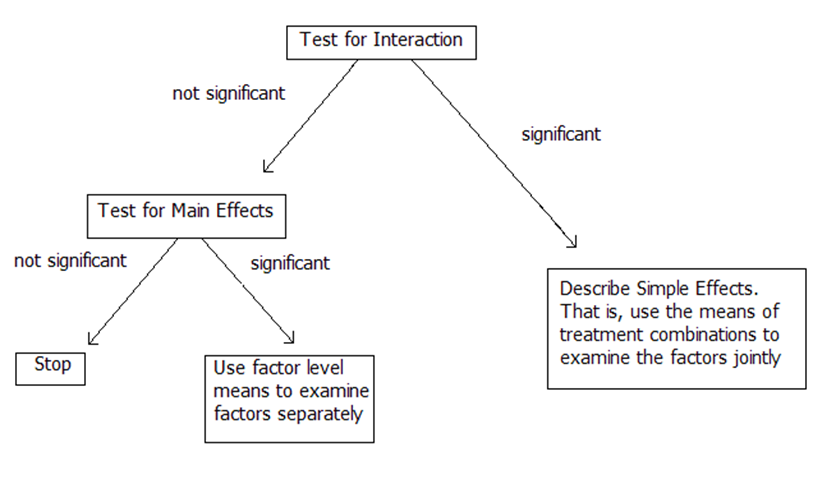

# Analyzing a Factorial: Model, ANOVA, and Decision Flow

## Example 4.2: Bakery

```{=html}
<style>
.reveal .slides .small table { font-size: 0.78em; line-height:1.05; }
.reveal .slides .small table th, .reveal .slides .small table td { padding:6px 8px; }
</style>
```

::::: columns
::: column
**Treatment Structure:** 3 x 2 Full Factorial

-   Shelf Height (Bottom, Middle, Top)
-   Shelf Width (Regular, Wide)

**Design Structure:** CRD with r = 2 stores per treatment combination.

**Response:** Bread Sales
:::

::: column
```{r}
#| fig-align: center
#| out-width: 90%

library(tidyverse)
library(emmeans)
library(multcompView)
library(multcomp)

knitr::include_graphics("_images/042-bakerys.png")
```
:::
:::::

## What changes when we add a factor?

-   We add:
    -   Another main effect
    -   An interaction term
-   We must decide what effects are present *before* interpreting the treatment means.

> The goal of the analysis is to decide which effects matter.

## The Treatment Effects Model (Two-way Factorial)

<span style="font-size:0.7em"> $$y_{ijk}=\mu+\alpha_i+\beta_j+\alpha\beta_{ij}+\epsilon_{ijk} \text{ with } \epsilon_{ijk} \sim \text{ iid }N(0,\sigma^2)$$
</span>

<span style="font-size:0.7em">
$$\text{for } i=1,2,3,…,a; j=1,2,…,b;   k=1,2,….,r$$
</span>

- <span style="font-size:0.7em">$y_{ijk}$: is the response (sales) from the $k^{th}$ experimental unit (store) using the $i^{th}$ level of Factor A (height) and $j^{th}$ level of Factor B (width) combination</span>
-   <span style="font-size:0.7em">$\mu$: is the grand/overall mean sales</span>
-   <span style="font-size:0.7em">$\alpha_i$: is the effect of the $i^{th}$ level of factor A (height)</span>
-   <span style="font-size:0.7em">$\beta_j$: is the effect of the $j^{th}$ level of factor B (width)</span>
-   <span style="font-size:0.7em">$\alpha\beta_{ij}$: is the interaction effect between the $i^{th}$ level of A (height) and $j^{th}$ level of B (width)</span>
-   <span style="font-size:0.7em">$\epsilon_{ijk}$: the experimental error associated with the $k^{th}$ experimental unit (store) using the $i^{th}$ level of Factor A (height) and $j^{th}$ level of Factor B (width) combination </span>

## ANOVA for Two-way Factorials

Just like one-way ANOVA: $SST = SSTrt + SSE$

For a factorial: $SSTrt = SSA + SSB + SSAB$

-   Main effect of factor A (Height): $SSA = rb\sum_i(\bar y_{i\cdot\cdot}-\bar y_{\cdot\cdot\cdot})^2$
-   Main effect of factor B (Width): $SSB = ra\sum_j(\bar y_{\cdot j\cdot}-\bar y_{\cdot\cdot\cdot})^2$
-   AB Interaction Effect (Height x Width): $SSAB = SST - SSE - SSA - SSB$

## Full ANOVA Table (Two-way) {.small}

| Source (SV) | df | SS | MS | F |   |
|----|----|----|----|----|----|
| A | $a-1$ | SSA | MSA $=\frac{SSA}{a-1}$ | $\frac{MSA}{MSE}$ | Do avg sales differ across shelf heights? |
| B | $b-1$ | SSB | MSB $=\frac{SSB}{b-1}$ | $\frac{MSB}{MSE}$ | Do avg sales differ across shelf widths? |
| AB | $(a-1)(b-1)$ | SSAB | MSAB $=\frac{SSAB}{(a-1)(b-1)}$ | $\frac{MSAB}{MSE}$ | Does the effect of width *depend* on height? |
| Error: e.u.(AB) | $(r-1)ab$ | SSE | MSE $=\frac{SSE}{(r-1)ab}$ |  |  |
| Total | $N-1$ | SST |  |  |  |

## Decision Flowchart

```{r}
#| fig-align: center
#| out-width: 70%

```

## What are we testing?

**Interaction**

$$H_0:\text{ All } \alpha\beta_{ij} = 0 \text{  vs  } H_A: \text{At least one } \alpha\beta_{ij} \ne 0$$

**Main Effect of A**

$$H_0:\text{ All } \alpha_{i} = 0 \text{  vs  } H_A: \text{At least one } \alpha_{i} \ne 0$$

**Main Effect of B**

$$H_0:\text{ All } \beta_{j} = 0 \text{  vs  } H_A: \text{At least one } \beta_{j} \ne 0$$

## Example 4.2: Skeleton ANOVA

| Source of Variation | DF = 12 stores - 1 = 11 total df |
|---------------------|----------------------------------|
|                     |                                  |

## R: Fitting the Model

Let's prep the data...

::: columns

:::{.column width=65%}

```{r}
#| echo: true
bakery_data <- read_csv("_data/04-bakery_data.csv") |>  
  mutate(height = factor(height, 
                         levels = c("bottom", "middle", "top")),
         width = factor(width, levels = c("regular", "wide")))

head(bakery_data)
```
:::

:::{.column width=35%}
```{r}
#| echo: true


levels(bakery_data$height)
levels(bakery_data$width)
```
:::
:::
## R: Fitting the Model

```{r}
#| echo: true
options(contrasts = c("contr.sum", "contr.poly"))
bakery_mod <- lm(sales ~ height + width + height:width, data = bakery_data)
```

::::: columns
::: column
```{r}
#| echo: true
anova(bakery_mod)
```
:::

::: column
```{r}
#| echo: true
summary(bakery_mod)
```
:::
:::::


## Recall, "sum to zero" {.small}

$\hat\mu =$

::::: columns
::: column
| Height |                   |
|--------|-------------------|
| Bottom | $\hat\alpha_1=7$  |
| Middle | $\hat\alpha_2=16$ |
| Top    | $\hat\alpha_3=$   |
:::

::: column
| Width   |                  |
|---------|------------------|
| Regular | $\hat\beta_1=-1$ |
| Wide    | $\hat\beta_2=$   |
:::
:::::

|            | Regular                         | Wide                          |
|------------|---------------------------------|-------------------------------|
| **Bottom** | $\widehat{\alpha\beta}_{11}=2$  | $\widehat{\alpha\beta}_{12}=$ |
| **Middle** | $\widehat{\alpha\beta}_{21}=-1$ | $\widehat{\alpha\beta}_{22}=$ |
| **Top**    | $\widehat{\alpha\beta}_{31}=$   | $\widehat{\alpha\beta}_{32}=$ |

## Decomposition of Model Effects

<span style="font-size:0.75em">Recall our statistical effects model: $y_{ijk} = \mu +\alpha_i +\beta_j + \alpha\beta_{ij} + \epsilon_{ijk}$</span>

```{r}
#| out-width: 70%

# Make sure placement is a factor in the right order
bakery_data <- bakery_data |>
  mutate(placement = factor(placement))

overall_mean <- bakery_data |> 
  summarise(mean_sales = mean(sales))

width_means <- bakery_data |>
  group_by(width) |>
  summarise(mean_sales = mean(sales))

height_means <- bakery_data |>
  group_by(height) |>
  summarise(mean_sales = mean(sales))

placement_means <- bakery_data |>
  group_by(height, width, placement) |>
  summarise(mean_sales = mean(sales))

placement_means <- placement_means |>
  mutate(x = as.numeric(placement))

# Map each width/height to the range of x positions for its levels
width_x_ranges <- placement_means |>
  group_by(width) |>
  summarise(xmin = min(x),
            xmax = max(x))

height_x_ranges <- placement_means |>
  group_by(height) |>
  summarise(xmin = min(x),
            xmax = max(x))

# Merge ranges with the mean data
width_means <- left_join(width_means, width_x_ranges, by = "width")
height_means <- left_join(height_means, height_x_ranges, by = "height")

# ---- PLOT ----
bakery_data |> 
  ggplot(aes(x = placement, y = sales)) +
  geom_point(size = 3, aes(shape = width)) +
  
  geom_hline(
    data = overall_mean,
    aes(yintercept = mean_sales),
    color = "black", linetype = "solid", linewidth = 1
  ) +
  
  geom_hline(
    data = width_means,
    aes(yintercept = mean_sales),
    color = "steelblue", linewidth = 1.2,
    linetype = "dashed"
  ) +

  geom_segment(
    data = height_means,
    aes(x = xmin - 0.4, xend = xmax + 0.4,
        y = mean_sales, yend = mean_sales),
    color = "darkorange", linetype = "dashed", linewidth = 1.2
  ) +
  
  geom_segment(
    data = placement_means,
    aes(x = x - 0.4, xend = x + 0.4,
        y = mean_sales, yend = mean_sales),
    color = "black", linewidth = 1.2,
    linetype = "dotted"
  ) +
  
  theme_minimal() +
  theme(legend.position = "none") +
  labs(
    x = "",
    y = "Sales",
    title = "Model Effects Decomposition"
  )

```

## Model Diagnostics


::::: columns
::: column
```{r}
#| echo: true
#| code-folding: true
bakery_mod |> 
  broom::augment() |> 
  ggplot(aes(x = .fitted, y = .resid)) +
  geom_point() +
  geom_hline(yintercept = 0,
             color = "#3a86d4") +
  labs(x = "Fitted Values", y = "Residuals")
```
:::

::: column
```{r}
#| echo: true
#| code-folding: true
bakery_mod |> 
  broom::augment() |> 
  ggpubr::ggqqplot(x = ".resid",
         color = "#3a86d4") +
  labs(title = "Normal QQ-Plot of Residuals")
```
:::
:::::


# Example: No Interaction, interpret Main Effects


## Example 4.2: Bakery

```{=html}
<style>
.reveal .slides .small table { font-size: 0.78em; line-height:1.05; }
.reveal .slides .small table th, .reveal .slides .small table td { padding:6px 8px; }
</style>
```

::::: columns
::: column
**Treatment Structure:** 3 x 2 Full Factorial

-   Shelf Height (Bottom, Middle, Top)
-   Shelf Width (Regular, Wide)

**Design Structure:** CRD with r = 2 stores per treatment combination.

**Response:** Bread Sales
:::

::: column
```{r}
#| fig-align: center
#| out-width: 90%

library(tidyverse)
library(emmeans)
library(multcompView)
library(multcomp)

knitr::include_graphics("_images/042-bakerys.png")
```
:::
:::::

## The Treatment Effects Model (Two-way Factorial)

<span style="font-size:0.7em"> $$y_{ijk}=\mu+\alpha_i+\beta_j+\alpha\beta_{ij}+\epsilon_{ijk} \text{ with } \epsilon_{ijk} \sim \text{ iid }N(0,\sigma^2)$$
</span>

<span style="font-size:0.7em">
$$\text{for } i=1,2,3,…,a; j=1,2,…,b;   k=1,2,….,r$$
</span>

- <span style="font-size:0.7em">$y_{ijk}$: is the response (sales) from the $k^{th}$ experimental unit (store) using the $i^{th}$ level of Factor A (height) and $j^{th}$ level of Factor B (width) combination</span>
-   <span style="font-size:0.7em">$\mu$: is the grand/overall mean sales</span>
-   <span style="font-size:0.7em">$\alpha_i$: is the effect of the $i^{th}$ level of factor A (height)</span>
-   <span style="font-size:0.7em">$\beta_j$: is the effect of the $j^{th}$ level of factor B (width)</span>
-   <span style="font-size:0.7em">$\alpha\beta_{ij}$: is the interaction effect between the $i^{th}$ level of A (height) and $j^{th}$ level of B (width)</span>
-   <span style="font-size:0.7em">$\epsilon_{ijk}$: the experimental error associated with the $k^{th}$ experimental unit (store) using the $i^{th}$ level of Factor A (height) and $j^{th}$ level of Factor B (width) combination </span>

## Decision Flowchart

```{r}
#| fig-align: center
#| out-width: 70%

```

## What are we testing?

**Interaction**

$$H_0:\text{ All } \alpha\beta_{ij} = 0 \text{  vs  } H_A: \text{At least one } \alpha\beta_{ij} \ne 0$$

**Main Effect of A**

$$H_0:\text{ All } \alpha_{i} = 0 \text{  vs  } H_A: \text{At least one } \alpha_{i} \ne 0$$

**Main Effect of B**

$$H_0:\text{ All } \beta_{j} = 0 \text{  vs  } H_A: \text{At least one } \beta_{j} \ne 0$$

## ANOVA

```{r}
#| echo: true
options(contrasts = c("contr.sum", "contr.poly"))
bakery_mod <- lm(sales ~ height + width + height:width, data = bakery_data)
anova(bakery_mod)
```


## Do these results make sense?

Inspecting the interaction plot between height and width on bread sales, does there visually appear to be a significant interaction?

```{r}
#| fig-align: center
#| height: 4,
#| width: 4
#| out-width: 50%
#| echo: true
#| code-fold: true

emmip(bakery_mod, width ~ height, CIs = TRUE, adjust = "tukey") +
  labs(y = "Bread Sales",
       x = "height")
```

## Where should we proceed?

1. Interaction: We do not have enough evidence of a significant interaction effect between shelf height and shelf width on bread sales (F = 1.16; df = 2,6; p = 0.375).
2. Width Main: We do not have enough evidence of a significant main effect of shelf width on bread sales (F = 1.16; df = 1,6; p = 0.323).
3. **Height Main**: We do have evidence of a significant main effect of height on bread sales (F = 74.7; df = 2, 6; p < 0.0001).
 
 > What are the marginal mean sales for each height (sig main effect)?
 > Which heights differ?
 
## R: Marginal Height LSMEANS

:::: columns
::: column
```{r}
#| message: true
#| echo: true
library(emmeans)
height_lsmeans <- emmeans(bakery_mod, specs = ~ height) 
height_lsmeans
```
:::
::: column
```{r}
#| echo: true
#| fig-height: 5
#| fig-width: 5
emmip(bakery_mod, ~ height, CIs = TRUE, adjust = "tukey") +
  labs(y = "Bread Sales",
       x = "height")
```
:::
::::

## R: Height pairwise comparisons

:::: columns
::: column
```{r}
#| echo: true
pairs(height_lsmeans, 
      adjust = "tukey", infer = c(T,T))
```
:::
::: column
```{r}
#| echo: true
library(multcomp)
cld(height_lsmeans, 
    decreasing = F, Letters = LETTERS, 
    adjust = "tukey")
```
:::
::::


## What can we conclude?

+ For bread placed on the middle shelf, the estimated mean bread sales is 67 (s.e. = 1.61).
+ This is estimated to be 25 more sales than for bread placed on the top shelf (t = 10.99; df = 6; p < 0.0001) and 23 more sales than for bread placed on the bottom shelf (t = 10.12; df = 6; p = 0.0001).


# Example: Interaction Present, interpret Simple Effects


## Example 4.3: Asphalt

> A civil engineer conducted an experiment to evaluate differences among a set of compaction methods for their effect on the tensile strength of test specimens and to determine to what extent the aggregate type affected the comparisons among the compaction methods.  Twenty-four specimens of the asphalt concrete were constructed, and the eight treatment combinations were randomly assigned to the specimens.
>
> Example 6.2 from Design of Experiments: Statistical Principles of Research Design and Analysis, 2nd Edition by Robert O. Kuehl.  

## Example 4.3: Asphalt

:::: columns
::: column
**Factors:**
+ *Aggregate Type:* Basalt, Silicous
+ *Compaction Method:* Static, Regular kneading, Low kneading, Very low kneading

**Design:** CRD with $r=3$ specimens per treatment combination (N = 24)

**Response:** Tensile strength


```{r}
#| echo: true

asphalt_data <- read_csv("_data/04-asphalt_data.csv") |>
  mutate(aggregate  = factor(aggregate),
         compaction = factor(compaction))
```
::: {style="font-size: 50%;"}
Note: Because we didn't specify `levels =` in `factor()`, the levels of `aggregagte` and `compation` are in alphabetical order
:::

:::
::: column


```{r}
#| echo: true
#| eval: false
head(asphalt_data)
```

```{r}
asphalt_data |> 
  slice_head(n = 5) |> 
  knitr::kable() |> 
  kableExtra::scroll_box(height = "200px") |> 
  kableExtra::kable_styling(font_size = 20)

```


```{r}
#| echo: true
levels(asphalt_data$aggregate)
levels(asphalt_data$compaction)
```


:::
::::

## Example 4.3: Statistical Effects Model

<span style="font-size:0.7em"> $$y_{ijk}=\mu+\alpha_i+\beta_j+\alpha\beta_{ij}+\epsilon_{ijk} \text{ with } \epsilon_{ijk} \sim \text{ iid }N(0,\sigma^2)$$
</span>

<span style="font-size:0.7em">
$$\text{for } i=1,2; j=1,2,3,4;   k=1,2,3$$
</span>

- <span style="font-size:0.7em">$y_{ijk}$: is the observed tensile strength for the $k^{th}$s specimen receiving the $i^{th}$ Aggregate and $j^{th}$ Compaction</span>
-   <span style="font-size:0.7em">$\mu$: is the overall mean tensile strength</span>
-   <span style="font-size:0.7em">$\alpha_i$: is the effect of the $i^{th}$ level of Aggregate</span>
-   <span style="font-size:0.7em">$\beta_j$: is the effect of the $j^{th}$ level of Compaction</span>
-   <span style="font-size:0.7em">$\alpha\beta_{ij}$: is the interaction effect between the $i^{th}$ level of Aggregate and $j^{th}$ level of Compaction</span>
-   <span style="font-size:0.7em">$\epsilon_{ijk}$: the experimental error associated with the $k^{th}$ specimen receiving the $i^{th}$ Aggregate and $j^{th}$ Compaction</span>

## Decision Flowchart

```{r}
#| fig-align: center
#| out-width: 70%

```

## ANOVA


```{r}
#| echo: true
options(contrasts = c("contr.sum", "contr.poly"))
asphalt_mod <- lm(strength ~ aggregate*compaction, data = asphalt_data)
anova(asphalt_mod)
```


We have evidence to conclude there is a significant interaction between aggregate and compaction on tensile strength (F = 1145; df = 3,16; p < 0.0001).

> The effect of aggregate on tensile strength varies across different levels of compaction.

## Where should we proceed?

1. **Interaction:** We have evidence to conclude there is a significant interaction between aggregate and compaction on tensile strength (F = 1145; df = 3,16; p < 0.0001).
2. Aggregate Main: don't care.. misleading.
3. Compaction Main: don't care.. misleading.
 
 > How does the mean tensile strength for aggregates change depending on the compaction method?
 >
 > What combination of aggregate and compaction lead to higher tensile strengths?
 
## R: Interaction Plots

:::: columns
::: column
```{r}
#| echo: true
#| fig-align: center
#| fig-height: 4
#| fig-width: 6
library(emmeans)
emmip(asphalt_mod, 
      aggregate ~ compaction, 
      CIs = TRUE, adjust = "tukey")
```
:::
::: column
```{r}
#| echo: true
#| fig-align: center
#| fig-height: 4
#| fig-width: 6
emmip(asphalt_mod, 
      compaction ~ aggregate, 
      CIs = TRUE, adjust = "tukey")
```
:::
::::

## Joint Pairwise Comparisons: Aggregate x Compaction

```{r}
#| echo: true
library(multcomp)
axc_lsmeans <- emmeans(asphalt_mod, specs = ~ aggregate*compaction)
cld(axc_lsmeans, Letters = LETTERS, decreasing = T, adjust = "tukey")
```


## R: Aggregate | Compaction {.scrollable}

:::: columns
::: column
**Slice Tests**

```{r}
#| echo: true
joint_tests(axc_lsmeans, 
            by = "compaction")
```

```{r}
#| echo: true
#| fig-align: center
#| out-width: 100%
#| fig-height: 4
#| fig-width: 6
emmip(asphalt_mod, 
      compaction ~ aggregate, 
      CIs = TRUE, 
      adjust = "tukey")
```
:::
::: column

**Simple Effects**

```{r}
#| echo: true
emmeans(asphalt_mod, specs = ~ aggregate | compaction) |> 
  pairs(adjust = "tukey", infer = c(T,T))
```
:::
::::

## R: Compaction | Aggregate

:::: columns
::: column
**Slice Tests**

```{r}
#| echo: true
#| fig-align: center
#| out-width: 60%
joint_tests(axc_lsmeans, by = "aggregate")
emmip(asphalt_mod, aggregate ~ compaction, CIs = TRUE, adjust = "tukey")
```
:::
::: column

**Simple Effects**

```{r}
#| echo: true
emmeans(asphalt_mod, specs = ~ compaction | aggregate) |> 
  pairs(adjust = "tukey", infer = c(T,T))
```
:::
::::
