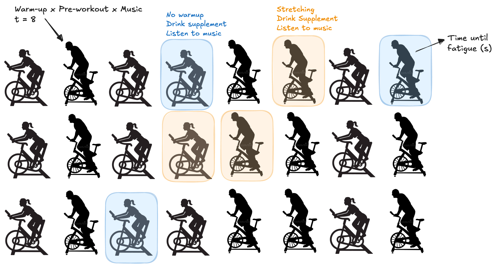
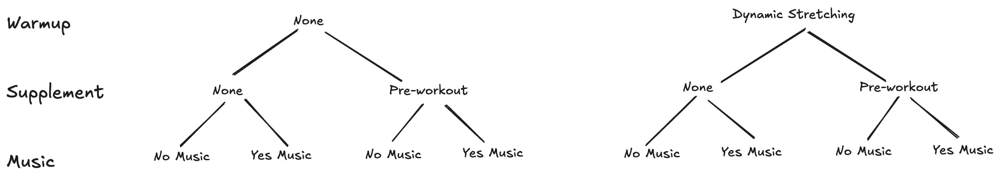

## Example 4.4: Exercise Performance

```{=html}
<style>
.reveal .slides .small table { font-size: 0.78em; line-height:1.05; }
.reveal .slides .small table th, .reveal .slides .small table td { padding:6px 8px; }
</style>
```

The effects of warm-up type (no warm-up vs. dynamic stretching), pre-workout supplement (none vs. pre-workout drink), and music type (no music vs. upbeat music) on exercise tolerance were studied in a small-scale experiment involving 24 adults aged 25-35. Exercise tolerance was measured as the number of minutes until the subject reached fatigue while performing on a stationary bicycle. Each participant was randomly assigned to a warm-up type – pre-workout supplement – music type condition before completing the exercise tolerance stress test. The data can be found in [`04-stress_test.csv`](_data/04_stress_data.csv).

## Example 4.4: The Data {.small}

```{r}
library(tidyverse)
library(emmeans)
stress_data <- read_csv("_data/04_stress_data.csv")
head(stress_data) |> 
  knitr::kable()

options(width = 200)
options(contrasts = c("contr.sum", "contr.poly"))
stress_mod <- lm(Tolerance ~ Warmup*Preworkout*Music, data = stress_data)
```

## Study Blueprint

```{r}
#| out-width: 80%

```

## Study Structure

**Treatment Structure**

A 2x2x2 full factorial between warm-up type (no warm-up vs. dynamic stretching), pre-workout supplement (none vs. pre-workout supplement), and music type (no music vs. upbeat music) for a total of t = 8 treatments.

**Experimental Structure**

Warm-up type, pre-workout supplement, and music type combinations are randomly assigned to subjects (e.u.) in a CRD with r = 3. The time until reaching fatigue on a stationary bicycle (seconds) is recorded for each subject (m.u.) for a total N = 24 subjects.

## Adding a Third Factor (2x2x2)

With three factors -> t = 8 treatments

```{r}
#| out-width: 90%

```

-   main effects: Warm-up, Pre-workout, Music
-   two-way interactions: Warm-up x Pre-workout, Warm-up x Music, Pre-workout x Music
-   three-way interaction: Warm-up x Pre-workout x Music

## What is a three-way interaction?

+ <span style="font-size:0.8em"> A three-way interaction exists when the way two factors interact depends on the level of a third factor. </span>
+ <span style="font-size:0.8em">AKA: a two-way interaction is not consistent across levels of a third factor. </span>

```{r}
#| fig-width: 9
#| fig-height: 4
#| out-width: 60%
emmip(stress_mod, Preworkout ~ Music | Warmup) +
  theme(aspect.ratio = 1) +
  labs(y = "Tolerance (seconds)") +
  guides(color = guide_legend(reverse = TRUE))
```

## 3-way Treatment Effects Model

$$y_{ijkl}=\mu+\alpha_i+\beta_j+\gamma_k+\alpha\beta_{ij}+\alpha\gamma_{ik}+\beta\gamma_{jk}+\alpha\beta\gamma_{ijk}+\epsilon_{ijkl} \text{ with } \epsilon_{ijkl} \text{ iid }\sim N(0,\sigma^2)$$ for $i=1,2; j=1,2; k=1,2; l=1,2,3$

where... continued on next slide!

## 3-way Treatment Effects Model

<div style="font-size:0.7em">

-   $y_{ijkl}$: is the exercise tolerance (number of minutes until the subject reached fatigue) for the $l^{th}$ individual receiving the $i^{th}$ warm-up type, $j^{th}$ pre-workout supplement, and $k^{th}$ music type.
-   $\alpha_i$: the effect of the $i^{th}$ level of warm-up type.
-   $\beta_j$: the effect of the $j^{th}$ level of pre-workout supplement.
-   $\gamma_k$: the effect of the $k^{th}$ music type.
-   $\alpha\beta_{ij}$: the interaction effect between the $i^{th}$ level of warm-up type and $j^{th}$ level of pre-workout supplement.
-   $\alpha\gamma_{ik}$: the interaction effect between the $i^{th}$ level of warm-up type and $k^{th}$ level of music type.
-   $\beta\gamma_{jk}$: the interaction effect between the $j^{th}$ level of pre-workout supplement and $k^{th}$ level of music type.
-   $\alpha\beta\gamma_{ijk}$: the interaction effect between the $i^{th}$ level of warm-up type, $j^{th}$ level of pre-workout supplement, and $k^{th}$ level of music type.
-   $ϵ_{ijkl}$: the experimental error associated with the $l^{th}$ individual receiving the $i^{th}$ warm-up type, $j^{th}$ pre-workout supplement, and $k^{th}$ music type.

</div>

## 3-way ANOVA Table {.small}

| SV      | DF              | SS    | MS = SS/DF | F         |
|---------|-----------------|-------|------------|-----------|
| A       | a-1             | SSA   | MSA        | MSA/MSE   |
| B       | b-1             | SSB   | MSB        | MSB/MSE   |
| C       | c-1             | SSC   | MSC        | MSC/MSE   |
| AB      | (a-1)(b-1)      | SSAB  | MSAB       | MSAB/MSE  |
| AC      | (a-1)(c-1)      | SSAC  | MSAC       | MSAC/MSE  |
| BC      | (b-1)(c-1)      | SSBC  | MSBC       | MSBC/MSE  |
| ABC     | (a-1)(b-1)(c-1) | SSABC | MSABC      | MSABC/MSE |
| Error   | (r-1)(abc)      | SSE   | MSE        |           |
| *Total* | N-1             |       |            |           |

## Example 4.4: 3-way Skeleton ANOVA

| Source of Variation  | DF  |
|----------------------|-----|
|                      |     |

## R: Fit 3-way Analysis

```{r}
#| echo: true
options(contrasts = c("contr.sum", "contr.poly"))
# same as Tolerance ~ Warmup + Preworkout + Music + Warmup:Preworkout + Warmup:Music + Preworkout:Music + Warmup:Preworkout:Music
stress_mod <- lm(Tolerance ~ Warmup*Preworkout*Music, data = stress_data)
```

:::: columns
::: column
This is your roadmap!
```{r}
anova(stress_mod)
```
:::
::: column
These are your parameter estimates!
```{r}
summary(stress_mod) 
```
:::
::::

## Check Model Assumptions: $\epsilon_{ijkl} iid \sim N(0, \sigma^2)$

:::: columns
::: column
```{r}
#| echo: true
#| code-fold: true
#| fig-width: 6
#| fig-height: 6


plot(stress_mod)
```


## 3-way Decision Flowchart

```{r}
knitr::include_graphics("images/046-three-way-decision-flowchart.png")
```

## What are we testing with the F-tests?

:::: columns
::: column
**3-way Interaction**

$$\scriptsize H_0:\text{ All } \alpha\beta\gamma_{ijk} = 0 \text{  vs  } H_A: \text{At least one } \alpha\beta\gamma_{ijk} \ne 0$$

**2-way Interactions**

$$\scriptsize H_0:\text{ All } \alpha\beta_{ij} = 0 \text{  vs  } H_A: \text{At least one } \alpha\beta_{ij} \ne 0$$
$$\scriptsize H_0:\text{ All } \alpha\gamma_{ik} = 0 \text{  vs  } H_A: \text{At least one } \alpha\gamma_{ik} \ne 0$$
$$\scriptsize H_0:\text{ All } \beta\gamma_{jk} = 0 \text{  vs  } H_A: \text{At least one } \beta\gamma_{jk} \ne 0$$
:::
::: column
**Main Effects**

$$\scriptsize H_0:\text{ All } \alpha_{i} = 0 \text{  vs  } H_A: \text{At least one } \alpha_{i} \ne 0$$
$$\scriptsize H_0:\text{ All } \beta_{j} = 0 \text{  vs  } H_A: \text{At least one } \beta_{j} \ne 0$$
$$\scriptsize H_0:\text{ All } \gamma_{k} = 0 \text{  vs  } H_A: \text{At least one } \gamma_{k} \ne 0$$
:::
::::

## Let's go back to our ANOVA Table (i.e., Roadmap)

What should we test first? Then what?

:::: columns
::: column
```{r}
anova(stress_mod)
```
:::
::: column
```{r}
knitr::include_graphics("images/046-jmp-anova.png")
```
:::
::::

## What should we "dig into"?

1. 3-way interaction:

  + At an $\alpha = 0.05$ we do not have enough evidence to conclude there is a significant 3-way interaction between warmup, preworkout, and music on the tolerance (F = 0.2; df = 1,16; p = 0.6604).

## What should we "dig into"?

2. 2-way interactions:

  + **We have enough evidence to conclude there is a significant 2-way interaction between preworkout and music on the tolerance (F = 7.76; df = 1,16; p = 0.0132).**
  + We do not have enough evidence to conclude there is a significant 2-way interaction between warmup and music on the tolerance (F = 1.19; df = 1,16; p = 0.2922).
  + We do not have enough evidence to conclude there is a significant 2-way interaction between warmup and preworkout on the tolerance (F = 1.46; df = 1,16; p = 0.2441). 
  
## What should we "dig into"?

3. Main effects:

  + Music.. don't care.
  + Preworkout.. don't care
  + **We have enough evidence to conclude there is a significant main effect of warmup on the tolerance (F = 18.91; df = 1,16; p = 0.0005).**
  
## What should we "dig into"?

```{r}
#| fig-align: center
#| out-width: 40%
knitr::include_graphics("images/046-three-way-decision-flowchart-stress.png")
```

+ 2-way interaction between preworkout x music (averaged over warm-up)
+ Main effect of warm-up (separately)
  
## R: 2-way Interaction Effect: Preworkout x Music

*Averaged over workout levels: none/stretching*

:::: columns
::: column
```{r}
#| echo: true
#| fig-height: 5
#| fig-width: 7
#| out-width: 70%
#| fig-align: center
library(emmeans)
library(multcomp)
emmip(stress_mod, Music ~ Preworkout, CIs = TRUE, adjust = "tukey")
```
:::
::: column
```{r}
#| echo: true
emmeans(stress_mod, specs = ~ Preworkout*Music) |> 
  cld(Letters = LETTERS, decreasing = T, adjust = "tukey")
```
:::
::::

## JMP: 2-way Interaction Effect: Preworkout x Music

Scroll over to `r fontawesome::fa("caret-down", fill = "red")` `Preworkout*Music`

:::: columns
::: column
```{r}
#| fig-align: center
#| out-width: 75%
knitr::include_graphics("images/046-jmp-preworkoutxmusic.png")
```
:::
::: column
```{r}
#| fig-align: center
#| out-width: 75%
knitr::include_graphics("images/046-jmp-preworkoutxmusic-letters.png")
```
:::
::::

## Pairwise Comparisons: Preworkout x Music (avg over Workout)

```{r}
#| echo: true
emmeans(stress_mod, specs = ~ Preworkout*Music) |>
  pairs(adjust = "tukey", infer = c(T,T))
```

```{r}
#| fig-align: center
#| out-width: 65%
knitr::include_graphics("images/046-jmp-preworkoutxmusic-pairwise.png")
```

## R: Main effect of Warmup

:::: columns
::: column
```{r}
#| echo: true
#| fig-height: 5
#| fig-width: 5
#| out-width: 70%
#| fig-align: center
library(emmeans)
library(multcomp)
emmip(stress_mod, ~ Warmup, CIs = TRUE, adjust = "tukey")
```
:::
::: column
```{r}
#| echo: true
emmeans(stress_mod, specs = ~ Warmup) |> 
  cld(Letters = LETTERS, decreasing = T, adjust = "tukey")
emmeans(stress_mod, specs = ~ Warmup) |> 
  pairs(adjust = "tukey")
```
:::
::::

## JMP: Main effect of Warmup

Scroll over to `r fontawesome::fa("caret-down", fill = "red")` `Warmup`

:::: columns
::: column
```{r}
#| out-width: 65%
knitr::include_graphics("images/046-jmp-warmup-letters.png")
```
:::
::: column
```{r}
#| out-width: 90%
knitr::include_graphics("images/046-jmp-warmup-letters2.png")
```
:::
::::

## R: *What if* there had been a 3-way interaction?

:::: columns
::: {.column width=40%}
```{r}
#| out-width: 100%
#| echo: true
emmip(stress_mod, Preworkout ~ Music | Warmup, 
      CIs = TRUE, 
      adjust = "tukey")
```
:::
::: {.column width=60%}
```{r}
#| echo: true
emmeans(stress_mod, ~ Preworkout:Music:Warmup) |>
  cld(Letters = LETTERS, decreasing = T, adjust = "tukey")
```
:::
::::

## JMP: *What if* there had been a 3-way interaction?

Scroll over to `r fontawesome::fa("caret-down", fill = "red")` `Warmup*Preworkout*Music`

```{r}
#| fig-align: center
#| out-width: 70%
knitr::include_graphics("images/046-jmp-3way-lsmeans.png")
```
