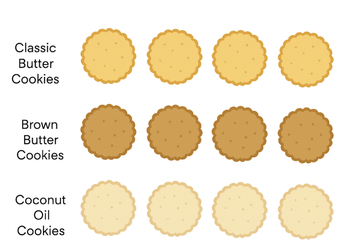
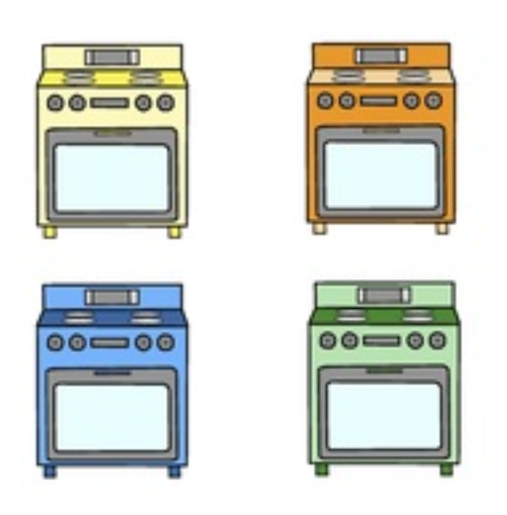
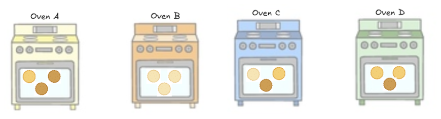
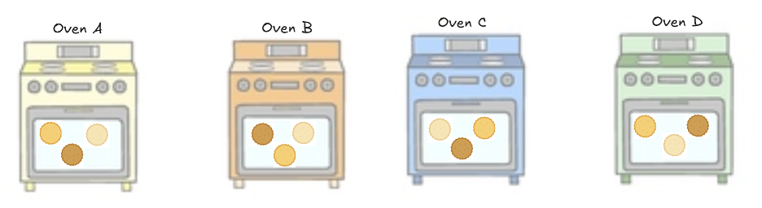
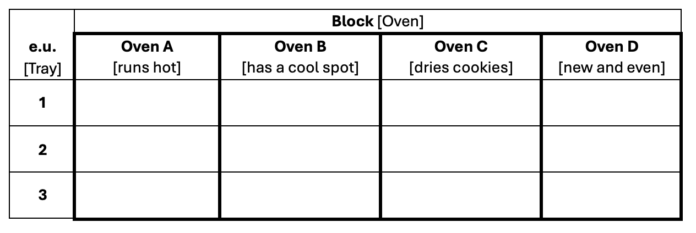

# Designing a RCBD

## Example 5.1: Cookies in Ovens

```{=html}
<style>
.reveal .slides .small table { font-size: 0.78em; line-height:1.05; }
.reveal .slides .small table th, .reveal .slides .small table td { padding:6px 8px; }
</style>
```

:::: columns
::: column

> A bakery wants to compare three different cookie recipes for a new product line. The recipes differ in type of fat used: Classic Butter, Brown Butter, and Coconut Oil. Cookie quality is evaluated based on texture scores from a tasting panel.

:::
::: column
```{r}
#| fig-align: center
#| out-width: 70%

```
:::
::::

## Example 5.1: The Complication

:::: columns
::: {.column width=65%}
> But...the bakery uses multiple ovens
>
> The ovens are known to differ slightly in temperature calibration and air circulation. These differences can affect how cookies bake. For example, some ovens may run hotter, producing crispier cookies, while others bake more slowly and yield softer cookies. Although one oven may be relatively consistent, overall consistency between ovens is unlikely.

:::
::: {.column width=35%}
```{r}
#| fig-align: center
#| out-width: 100%

```
:::
::::

## Suppose there were *no restrictions* on recipe randomization

**Completely Randomized Design (CRD)**

```{r}
#| fig-align: center
#| out-width: 70%

```

<div style="font-size:0.8em">

+ Suppose Oven A runs slightly hotter than the others. How will this affect the results if that oven happens to get more Brown Butter trays?

+ Suppose Oven B runs cooler and happens to bake most of the Coconut Oil trays. How will this affect the results?

</div>

## Where the CRD breaks down

> Key Idea: We can’t separate recipe effects from oven effects.

CRD assumes:

+ Experimental units are homogeneous

But here:

+ Trays within an oven are similar
+ Trays across ovens are *not* similar

## The Solution: Block on oven

**Randomized Complete Block Design (RCBD)**

Why ovens? big source of variation, not scientifically interesting, known before the experiment

```{r}
#| fig-align: center
#| out-width: 70%

```

> Key Idea: Block on what you can’t control but can identify.

## What ‘Randomized Complete’ means

::: callout-note
## Elements of a RCBD

+ **Block:** This is a homogeneous group of experimental units. A RCBD consists of first sorting the experimental units into blocks.

+ **Complete:** Each block consists of one complete replication of the set of treatments. Therefore, each treatment will show up once within each block.

+ **Randomized:** The treatments are randomly assigned to experimental units separately within each block.
:::

## Why Block?

<div style="font-size:0.8em">

**Advantages**

+ Effective blocking can lead to reduced experimental error and more precise estimates of treatment effects.
+ The RCBD can accommodate any number of treatments and replications.
+ The statistical analysis is relatively simple.

**Disadvantages**

+ The degrees of freedom for experimental error are not as large as for a CRD.

</div>

## Example 5.1: Study Structure

**Treatment structure**

One-way treatment structure with cookie recipes (3 levels – classic butter, brown butter, and coconut oil).

**Experimental structure**

Cookie recipe treatments are randomly assigned to trays (e.u.) in a RCBD (randomized complete block design) with M = 4 blocks (or replications!) where the blocking factor is oven. The texture score is recorded for each tray (m.u.).

## Designing a RCBD

```{r}
#| fig-align: center
#| out-width: 90%

```

## R: Designing a RCBD with `edible` package

```{r}
#| echo: true
#| output-location: column
library(tidyverse)
library(edibble)

des <- design("Cookies in Ovens") |>
  set_units(oven  = c("Oven A", "Oven B", "Oven C", "Oven D"),
            tray  = nested_in(oven, 3)) |>
  set_trts(recipe = c("Classic Butter", "Brown Butter", "Coconut Oil")) |>
  allot_trts(recipe ~ tray) |>
  assign_trts("random")

cookie_data <- serve_table(des)
cookie_data$texture <- NA
cookie_data
```

:::callout-note
We are going to skip the "by hand" design in R because it is a bit more complicated! But note that what is happening is that we are independently implementing a CRD within each block.
:::


## R: Check your RCBD

:::: columns
::: column

**Does each oven have 3 trays?**

```{r}
#| echo: true
cookie_data |> 
  count(oven)
```

**Does each recipe appear r = 4 times?**

```{r}
#| echo: true
cookie_data |> 
  count(recipe)
```
:::
::: column

**Does each recipe appear *once* in each oven?**

```{r}
#| echo: true
cookie_data |> 
  count(oven, recipe)
```
:::
::::

# Analyzing a RCBD


## Example 5.1: Cookie Recipes

```{=html}
<style>
.reveal .slides .small table { font-size: 0.78em; line-height:1.05; }
.reveal .slides .small table th, .reveal .slides .small table td { padding:6px 8px; }
</style>
```

```{r}
#| fig-align: center
#| out-width: 70%
library(emmeans)
library(multcomp)

```

::: {style="font-size:0.8em"}
**Treatment Structure:** One-way with recipe (3-levels $t = 3$: classic butter, brown butter, coconut oil)

**Design Structure:** Recipe randomly assigned to tray (e.u.) in an RCBD with M = 4 ovens (blocking factor). Texture recorded for each tray (m.u.).
:::

## Cookie Recipes

:::: columns
::: column
```{r}
#| echo: true
cookie_data <- read_csv("_data/05-cookie_rcbd_data.csv")
cookie_data
```
:::
::: column
```{r}
#| fig-width: 5
#| fig-height: 5
#| fig-align: center
cookie_data |> 
  ggplot(aes(x = recipe, 
             y = texture,
             color = oven,
             shape = oven)
         ) +
  geom_point(size = 3) +
  theme_bw() +
  theme(aspect.ratio = 1) +
  scale_color_brewer(palette = "Dark2") +
  labs(x = "Recipe",
       y = "Cookie Texture",
       color = "Oven",
       shape = "Oven")
```
:::
::::

## What changes from a CRD?

If we analyze *ignoring* the effect of oven...

::: callout-caution
### Incorrect Analysis: CRD

$y_{im} = \mu + \tau_i + \epsilon_{im} \text{ where } \epsilon_{im} \text{iid}\sim N(0,\sigma^2)$

```{r}
#| echo: true
oven_crd_mod <- lm(texture ~ recipe, data = cookie_data)
anova(oven_crd_mod)
```
:::

## Statistical Effects Model

<div style="font-size:0.75em">

$$y_{im} = \mu + \tau_i + \rho_m + \epsilon_{im} \text{ where } \epsilon_{im} \text{ iid}\sim N(0,\sigma^2)$$ for $i = 1, 2, 3$ and $m = 1, 2, 3, 4$

where:

+ $y_{im}$ is the observed texture of the cookie tray baked in the $m^{th}$ oven with the $i^{th}$ recipe.
+ $\mu$ is the overall mean texture
+ $\tau_i$ is the effect of the $i^{th}$ recipe
+ $\rho_j$ is the effect of the $m^{th}$ oven
+ $\epsilon_{ij}$ is the experimental error associated with the cookie tray baked in the $m^{th}$ oven with the $i^{th}$ recipe.

</div>

## What Blocking does to the variability

$$SST = SSTrt + SSBlk + SSE$$

-   $SST = \sum_i\sum_j(y_{im}-\bar y_{\cdot\cdot})^2$
-   $SSTrt = M \sum_i(\bar y_{i\cdot}-\bar y_{\cdot\cdot})^2$
-   $SSBlk = t\sum_j(\bar y_{\cdot m}-\bar y_{\cdot\cdot})^2$
-   $SSE = t\sum_j(y_{ij}-\bar y_{i\cdot} - \bar y_{\cdot m} + \bar y_{\cdot\cdot})^2$

## ANOVA Table {.small}

| Source of Variation | DF | SS | MS | F |
|----|----|----|----|----|
| Block | M - 1 | SSBlk | MSBlk | MSBlk/MSE |
| Treatment | t - 1 | SSTrt | MSTrt | MSTrt/MSE |
| Block x Treatment $\rightarrow$ error | (M - 1)(t - 1) | SSE | MSE $\rightarrow \sigma^2$ |  |
| **Total (N = M$\times$ t)** | **N - 1** | SST |  |  |

> Blocking is a *design tool*, not usually a research question.

## Skeleton ANOVA

| Source of Variation | DF  |
|---------------------|-----|
|                     |     |

## R: RCBD Analysis

::::: columns
::: column
```{r}
#| echo: true
#| fig-width: 7
#| fig-height: 5
#| out-width: 55%
options(contrasts = c("contr.sum", "contr.poly"))
oven_rcbd_mod <- lm(texture ~ recipe + oven, data = cookie_data)
anova(oven_rcbd_mod)
emmip(oven_rcbd_mod, ~ recipe, CI = T)
```
:::

::: column
```{r}
#| echo: true
emmeans(oven_rcbd_mod, ~ recipe) |> 
  cld(Letters = LETTERS, decreasing = T, adjust = "tukey")
```
:::
:::::

## Check Model Assumptions -- $\epsilon_{im} \text{iid} \sim N(0,\sigma^2)$


::::: columns
::: column
```{r}
#| echo: true
#| code-folding: true
oven_rcbd_mod |> 
  broom::augment() |> 
  ggplot(aes(x = .fitted, y = .resid)) +
  geom_point() +
  geom_hline(yintercept = 0,
             color = "#3a86d4") +
  labs(x = "Fitted Values", y = "Residuals")
```
:::

::: column
```{r}
#| echo: true
#| code-folding: true
oven_rcbd_mod |> 
  broom::augment() |> 
  ggpubr::ggqqplot(x = ".resid",
         color = "#3a86d4") +
  labs(title = "Normal QQ-Plot of Residuals")
```
:::
:::::


## RCBD vs CRD

<div style="font-size:0.75em">

::::: columns
::: column
If we ignore ovens (CRD):

-   Oven variability inflates MSE
-   Harder to detect recipe differences

```{r}
anova(oven_crd_mod)
```
:::

::: column
With RCBD:

-   Oven variability is removed from error
-   Smaller MSE
-   More power *(if blocks are different)*

```{r}
anova(oven_rcbd_mod)
```
:::
:::::

</div>

## Why is this model additive? (no interaction)

:::: columns
::: column
-   Each recipe appears *once* per oven
-   No replication within recipe-oven combinations
-   Interaction is not estimable

> Recall: The experimental error comes from the block x treatment term.

:::
::: column
```{r}
#| fig-width: 5
#| fig-height: 5
#| fig-align: center
cookie_data |> 
  ggplot(aes(x = recipe, 
             y = texture,
             color = oven,
             shape = oven)
         ) +
  geom_point(size = 3) +
  geom_line(aes(group = oven)) +
  theme_bw() +
  theme(aspect.ratio = 1) +
  scale_color_brewer(palette = "Dark2") +
  labs(x = "Recipe",
       y = "Cookie Texture",
       color = "Oven",
       shape = "Oven")
```
:::
::::


```{r}
#| include: false


oven_rcbd_mod2 <- lm(texture ~ recipe + oven + recipe:oven, data = cookie_data)
anova(oven_rcbd_mod2)

```
