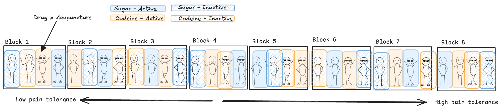

## Example 5.2: Dental

```{=html}
<style>
.reveal .slides .small table { font-size: 0.78em; line-height:1.05; }
.reveal .slides .small table th, .reveal .slides .small table td { padding:6px 8px; }
</style>
```


::: {style="font-size:0.75em"}
> An anesthesiologist made a comparative study of the effects of acupuncture and codeine on postoperative dental pain in male subjects. The four treatment combinations were as follows:
>
> -   Placebo treatment (a sugar pill and two inactive acupuncture points)
> -   Codeine treatment (a codeine pill and two inactive acupuncture points)
> -   Acupuncture only (a sugar pill and two active acupuncture points)
> -   Codeine and acupuncture (a codeine pill and two active acupuncture points)

> Thirty-two subjects were grouped into 8 blocks of size 4 according to an initial evaluation of their pain tolerance. The subjects in each block were then randomly assigned to the four treatment combinations. The pain relief scores were obtained for all subjects two hours after dental treatment (data were collected on a double-blind basis). The higher the pain relief score the more effective the treatment.
:::

## Example 5.2 Blueprint

```{r}

```

2.  Why do you think *pain tolerance* was used as a blocking variable?

## Example 5.2: Study Structure

**Treatment Structure**

A 2x2 full factorial between Drug (sugar/codeine) and Acupuncture (active/inactive) for a total of t = 4 treatment combinations.

**Experimental Structure**

Drug and acupuncture treatment combinations were randomly assigned to subjects (e.u.) in a RCBD with M = 8 replications (blocks) where pain tolerance is the blocking factor (block size = t = 4). We measured the pain releif scores on each subject (m.u.) for a total N = 32 subjects.

## Statistical Effects Model

::: {style="font-size:0.75em"}
$$y_{ijm} = \mu + \alpha_i + \beta_j + \alpha\beta_{ij} + \rho_m + \epsilon_{ijm} \text{ with } \epsilon_{ijm} \text{iid} \sim N(0,\sigma^2)$$ for $i = 1, 2; j = 1, 2; m = 1, 2, ..., 8$

Where:

-   $y_{ijm}$ is the pain relief score from the subject in the $m^{th}$ pain tolerance block receiving the $i^{th}$ level of drug and the $j^{th}$ level acupuncture
-   $\mu$ is the overall mean pain relief score
-   $\alpha_i$ is the effect of the $i^{th}$ level of drug
-   $\beta_j$ is the effect of the $j^{th}$ level of acupuncture
-   $\alpha\beta_{ij}$ is the interaction effect between the $i^{th}$level of drug and the $j^{th}$ level of acupuncture
-   $\rho_m$ is the effect of the $m^{th}$ block
-   $\epsilon_{ijk}$ is the experimental error associated with the subject from the $m^{th}$ block receiving the $i^{th}$ level of drug and the $j^{th}$ level of acupuncture
:::

## ANOVA Table

| Source of Variation            | DF          | SS    | MS    | F         |
|--------------------------------|-------------|-------|-------|-----------|
| Blocks                         | M-1         | SSBlk | MSBlk | MSBlk/MSE |
| A                              | a-1         | SSA   | MSA   | MSA/MSE   |
| B                              | b-1         | SSB   | MSB   | MSB/MSE   |
| AxB                            | (a-1)(b-1)  | SSAB  | MSAB  | MSAB/MSE  |
| Block x AB $\rightarrow$ error | (M-1)(ab-1) | SSE   | **MSE**   |           |
| Total (N = Mab)                | N-1         |       |       |           |

## Skeleton ANOVA

| Source of Variation | DF  |
|---------------------|-----|
|                     |     |

## Example 5.2: The Data

::: callout-warning
Ensure "block" is a factor/character!
:::

```{r}
#| label: setup

library(tidyverse)
library(emmeans)
```


```{r}
#| echo: true

dental_data <- read_csv("_data/05-dental_data.csv") |> 
  mutate(pain_tol = factor(pain_tol))

head(dental_data, n = 8)
levels(dental_data$pain_tol) # since pain_tol is factor, ths will work and show the order of the levels
```


## R: Analysis -- fit model

Fit model (don't forget sum to zero contraints!):

```{r}
#| echo: true

# set sum to zero constraint
options(contrasts = c("contr.sum", "contr.poly"))

# "fit" model -- saving model object to use in all of the rest of our analyses!
dental_mod <- lm(score ~ drug + acupuncture + drug:acupuncture + pain_tol, 
                 data = dental_data)
```

:::callout-note
# R model formulas and `lm` objects

The way we fit models in R using `lm` is by providing data + an *R formula*. R formulas are great because they *mirror* the statistical effects model that we write out mathematically for linear models! e.g. for our **two factor blocked model, the general formula** looks like:

`response_var ~ factorA + factorB + factorA:factorB + block`

That looks just like the statistical effects model! 

We could also use the shorthand formula:
`response_var ~ factorA*factorB  + block`

`delta_mod` is what we call a *model object* in R. All of the other functions that we use to do follow up analyses use this special kind of object -- nice!
:::

## R: Analysis -- ANOVA table

```{r}
#| echo: true
anova(dental_mod)
```
:::callout-note
# SST?

R does not output the Total row of the ANOVA table, because it can be easily calculated by hand based on the other rows! It also does not go into the inference calculations for ANOVA itself.

:::


## R: Analysis -- parameter estimates

:::callout-note
# Estimated model

$$\hat{y}_{ijm} = \hat{\mu} + \hat{\alpha}_i + \hat{\beta}_j + \hat{\alpha\beta}_{ij} + \hat{\rho}_m $$ 

We get all of these estimated parameters from the estimated coefficient output using `summary(mod_obj)`

:::

```{r}
#| echo: true
summary(dental_mod)
```


## Check Model Assumptions $\epsilon_{ijm} \text{iid} \sim N(0\sigma^2)$

:::callout-note
# Still just need our `mod_obj!`

Note that all you need to change in this code (as always) is the model object (in this example, `delta_mod`). How useful!

:::


::::: columns
::: column
```{r}
#| echo: true
#| code-folding: true
dental_mod |> 
  broom::augment() |> 
  ggplot(aes(x = .fitted, y = .resid)) +
  geom_point() +
  geom_hline(yintercept = 0,
             color = "#3a86d4") +
  labs(x = "Fitted Values", y = "Residuals")
```
:::

::: column
```{r}
#| echo: true
#| code-folding: true
dental_mod |> 
  broom::augment() |> 
  ggpubr::ggqqplot(x = ".resid",
         color = "#3a86d4") +
  labs(title = "Normal QQ-Plot of Residuals")
```
:::
:::::


## Factorial flow chart

> Where should we proceed with our analysis?


```{r}
#| echo: true
anova(dental_mod)
```


## Main Effect of Drug


:::columns
:::{.column width=70%}
```{r}
#| fig-width: 4
#| fig-height: 4
#| echo: true

dental_drug_lsmeans <- emmeans(dental_mod, ~ drug)
emmip(dental_mod, ~ drug, CIs = T)
dental_drug_lsmeans |> 
  pairs(infer = c(T,T))
```
:::

:::{.column width=30%}


::: {style="font-size:0.75em"}

:::callout-note
# R note

For theses follow-up analyses we need functions from the **emmeans** package.

The first step is creating an `lsmeans` object using the `emmeans()` function and our `mod_obj` object!

:::


> Codeine results in the highest mean pain relief at 1.42 (s.e. 0.03). This is, on average, 0.53 points more relief than the sugar pill (t = 12.64; df = 21; p \< 0.0001).
:::
:::
:::

## Main Effect of Acupuncture

:::columns
:::{.column width=70%}
```{r}
#| fig-width: 4
#| fig-height: 4
#| echo: true

dental_acu_lsmeans <- emmeans(dental_mod, ~ acupuncture)
emmip(dental_mod, ~ acupuncture, CIs = T)

dental_acu_lsmeans |> 
  pairs(infer = c(T,T))
```
:::

:::{.column width=30%}
::: {style="font-size:0.75em"}
> Active acupuncture results in the highest mean pain releif at 1.48 (s.e. = 0.03). This is, on average, 0.65 points higher than inactive acupuncture (t = 15.29; df = 21; p \< 0.0001).
:::
:::
:::


