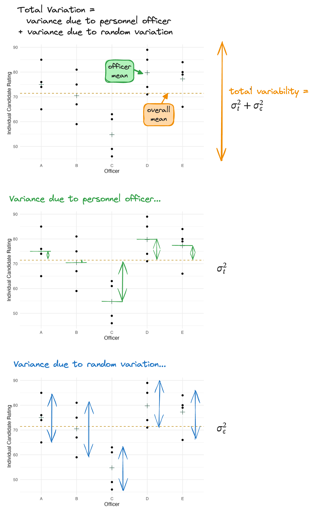
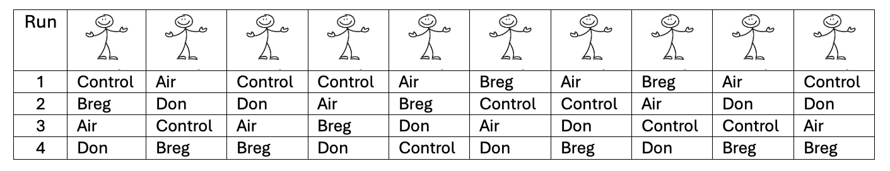

```{r}
#| label: setup

library(tidyverse)
library(lme4)
library(emmeans)
library(multcomp)
```

# Introduction to Random Effects

## Fixed Effects

```{=html}
<style>
.reveal .slides .small table { font-size: 0.78em; line-height:1.05; }
.reveal .slides .small table th, .reveal .slides .small table td { padding:6px 8px; }
</style>
```

Up to this point, we have been concerned exclusively with **fixed effects** models.

What were we always testing?

## Fixed Effects

Fixed effects are appropriate when:

+ Interest centers on the effects of the specific factor levels chosen.
+ If the experiment were to be repeated, the same levels would be chosen.
+ Interest is focused on means.

## Random Effects

Random effects are appropriate when:

+ The factor levels are a sample from a larger population of potential factor levels, and inferences are desired about the population of factor levels.
+ If the experiment were to be repeated, a new set of levels would be chosen.
+ Interest is focused on variances.

## The Conceptual Contrast

| Fixed                   | Random                                |
| ----------------------- | ------------------------------------- |
| Specific levels         | Sample of levels                      |
| Same levels if repeated | New levels if repeated                |
| Focus: means            | Focus: variances                      |
| Compare ($\mu_i$)       | Estimate ($\sigma^2_{\text{factor}}$) |


## Example 6.1: Retail Store. 

> Consider an experiment conducted by a company that owns several hundred retail stores.  Approximately 50 of the stores are selected at random, and employees in each store was asked to evaluate management. The company is NOT interested in just the 50 stores chosen – it wants to generalize the results to ALL of its stores. Further, suppose that employees were asked from each department (e.g., clothing, kitchen, etc.) in all 50 stores. Therefore, the company is interested in the employee evaluations of management by *department* and *store*.

## Is store fixed or random?

+ Were stores randomly selected?
+ Do we care about only these 50 stores?
+ If repeated, would we choose the same stores?

## Is department fixed or random?

+ Were departments randomly sampled?
+ Do these departments represent all *possible* departments?
+ If repeated, would we choose different departments?

## It turns out that whether a factor is fixed or random:

Does NOT change the design much

But...Changes the analysis.

# A Completely Randomized Design with Random Treatment Effects


## Example 6.2: Fast Food Company

```{=html}
<style>
.reveal .slides .small table { font-size: 0.78em; line-height:1.05; }
.reveal .slides .small table th, .reveal .slides .small table td { padding:6px 8px; }
</style>
```

<!-- > A company that builds fast-food restaurants leases franchises to individuals and provides management services.  This company also employs a large number of personnel officers who interview applicants for jobs in the restaurants. At the end of the interview, the officer assigns a rating between 0 and 100 to indicate the applicant’s potential value on the job.  Five personnel officers were selected at random, and each was assigned four candidates at random.  The company was interested in the extent of the variation in ratings among all personnel officers, and also the mean rating by all personnel officers. -->

> A company employs many personnel officers.
> 
> + Five officers were selected at random.
> + Each officer rated 4 candidates.
>
> Ratings are from 0–100.

The company wants to know:

+ The overall mean rating
+ The extent of variability in ratings among officers

   
## Study Blueprint

```{r}
#| fig-align: center
#| out-width: 70%

```

**Treatment structure:**
One-way: Officer (5 levels – officer A, B, C, D, E)

**Experimental structure:**
Officers were randomly assigned to interview r = 4 candidates (e.u.) in a CRD. The rating is recorded for each candidate (m.u.).

## Officer = Random Treatment Effect

```{r}
personnel_data <- read_csv("_data/06-personnel-data.csv") |> 
  mutate(officer = factor(officer),
         candidate = factor(candidate))
```

```{r}
#| include: false

ggplot(data = personnel_data,
             aes(x = officer, y = rating)) +
  stat_summary(geom = "point",
               fun.y = "mean",
               color = "#154734",
               shape = 3,
               size = 3) +
  geom_hline(yintercept = mean(personnel_data$rating),
             color = "#BD8B13",
             linetype = "dashed") +
  geom_point() +
  labs(x = "Officer",
       y = "Individual Candidate Rating") +
  theme_minimal() 

ggsave("_images/061-officer-plot.png",
       width = 6,
       height = 4,
       units = "in")
```


:::: columns
::: column
+ We are not comparing the mean ratings of officer A vs B vs C.
+ We are estimating variability among officers.
:::
::: column
```{r}
#| fig-align: center
#| out-width: 60%

```
:::
::::


## The Data {.small}

:::columns
:::{.column width=60%}
```{r}
#| echo: true

personnel_data <- read_csv("_data/06-personnel-data.csv") |> 
  mutate(officer = factor(officer),
         candidate = factor(candidate))
```

```{r}
#| echo: true

levels(personnel_data$candidate)
levels(personnel_data$officer)
```

:::callout-note
## Make experimental factors R factors!

Here we wanted to make sure that any categorical variables or factors in our experimental design are treated as the special `factor` type in R!
:::


:::
:::{.column width=40%}
```{r}      
personnel_data
```
:::
:::

## Statistical Random Effects Model

::: {style="font-size:0.7em"}

$$y_{ij}=\mu+t_i+\epsilon_{ij} \text{ for } i=1,2,3,4,5;	j=1,2,3,4$$

with:

+ $t_i \sim$ independent $N(0,\sigma_t^2)$ 
+ $\epsilon_{ij} \sim$ independent $N(0,\sigma_\epsilon^2 )$
+ $t_i$ is independent $\epsilon_{ij}$

where:

+ $y_{ij}$ is the rating of the $j^{th}$ candidate by the $i^{th}$ personnel officer
+ $\mu$ is the overall grand mean rating
+ $t_i$ is the effect of the $i^{th}$ personnel officer who is selected at random
+ $\epsilon_{ij}$ is the error associated with the $j^{th}$ candidate being rated by the $i^{th}$ personnel officer

:::

## REML (Residual Maximum Likelihood) Estimation

**Goal:** estimate variance components

- $\sigma_t^2$ = variability **among officers**  
- $\sigma_\epsilon^2$ = variability **within officer**  

**Why REML?**

- Ordinary ML tends to underestimate variance components (especially with small samples)
- REML adjusts for estimating fixed effects (here, $\mu$) before estimating variances

## R: Fitting the Random Effects Model 

:::: columns
:::{.column width=50%}
```{r}
#| echo: true
personnel_mod <- lmer(rating ~ (1 | officer), 
                      REML = TRUE, 
                      data = personnel_data)
summary(personnel_mod)
```
:::
:::{.column width=5%}
:::

:::{.column width=45%}

::: {style="font-size:0.7em"}
**Estimating Variances**

+ Total Variance = $\hat \sigma_t^2 + \hat \sigma_\epsilon^2 =$
+ What proportion of the total variance is due to personnel officer? $\frac{\hat\sigma_t^2}{\hat\sigma_t^2+\hat\sigma_\epsilon^2}=$

**Estimating the Overall Mean**

+ $\hat \mu =$
:::

:::
::::

## R: Fitting the Random Effects Model

:::: columns
::: column
```{r}
#| echo: true
#| eval: false

personnel_mod <- lmer(rating ~ (1 | officer), 
                      REML = TRUE, 
                      data = personnel_data)
summary(personnel_mod)
```
::: {style="font-size:0.7em"}
- The `lmer` function is part of the **lme4** package --  include `library(lme4)` at the beginning of your script.
- We save our `lmer` object (in this example, `personnel_mod`) to reference later! 
- `summary(personnel_mod)` gives us the information we generally want about the model fit.
:::
:::

::: column
Let's break down this code!

::: {style="font-size:0.7em"}
- Like with `lm()` we provide `lmer()` with (1) the data, and (2) a formula. 
- There are two special things for `lmer()` versus `lm()`:
   1. we specify `REML = TRUE`
   2. the formula is special
- The general form of a formula with a **fixed intercept**/overall mean ($\mu$) and **one random effect** factor ($t_i$), is 
  - `response ~ (1 | random_factor)`

:::

:::
::::

# Linear Mixed Models


## Example 6.3: Knee Brace

```{=html}
<style>
.reveal .slides .small table { font-size: 0.78em; line-height:1.05; }
.reveal .slides .small table th, .reveal .slides .small table td { padding:6px 8px; }
</style>
```

::: {style="font-size:0.75em"}
> Researchers study 4 knee braces: Control, Air Armor 2, Breg, Don Joy
>
> 10 high school running backs with previous ACL injury participate. Each player: Wears all 4 braces, Order randomized
>
> Time to complete 40-yard agility course recorded
:::

```{r}
#| fig-align: center
#| out-width: 90%

```

## Example 6.3: Skeleton ANOVA

Do we care only about these 10 running backs?

| Source of Variation | DF  |
|---------------------|-----|
|                     |     |

## When one factor is fixed and one is random

::: callout-note
### Linear Mixed Models (LMM)

Mixed models come about when one factor is fixed and one factor is random. A mixed model should be used to study the effects of one factor on the **population mean** and the effects of another factor on the **population variance**.
:::

## Statistical Effecs Model


::: {style="font-size:0.75em"}

$$y_{im} = \mu + \tau_i + p_m + \epsilon_{im} \text{ with }  p_m \sim \text{iid } N(0,\sigma_{blk}^2) \text{ and } \epsilon_{im} \sim \text{iid }  N(0,\sigma_\epsilon^2)$$

for $i=1,2,3;	m=1,2,…,10$

where:

+ $y_{ij}$ is the time to complete a 40-yard agility course for the $m^{th}$ running back (block) wearing the $i^{th}$ knee brace
+ $\mu$ is the overall mean time to complete the agility course
+ $\tau_i$ is the fixed effect of the $i^{th}$ knee brace
+ $p_m$ is the random effect of the $m^{th}$ running back (block)
+ $\epsilon_{im}$ is the random error term associated with the $m^{th}$ running back (block) wearing the $i^th$ knee brace 

:::

## Scope of Inference

::: callout-note
+ If blocks were fixed: Inference limited to these 10 running backs
+ If blocks are random: Inference extends to *all* similar running backs 
:::

## The Data {.small}

:::columns

:::{.column width=55%}

```{r}
#| echo: true
kneebrace_data <- read_csv("_data/06-kneebrace-data.csv") |> 
  janitor::clean_names() |>  # make column names nice
  mutate(running_back = factor(running_back),
         knee_brace = factor(knee_brace))
```

```{r}
#| echo: true

levels(kneebrace_data$running_back)
levels(kneebrace_data$knee_brace)
```

:::

:::{.column width=45%}

```{r}
#| echo: true

head(kneebrace_data, n = 12) #show first 12 rows
```
:::

:::

## R: Fitting a LMM

```{r}
#| echo: true

# sum to zero constraint
options(contrasts = c("contr.sum", "contr.poly"))

# general formula: response ~ fixed_effect + (1 | random_effect)
kneebrace_mod <- lmer(agility_time ~ knee_brace + (1 | running_back), 
                      data = kneebrace_data)
summary(kneebrace_mod)
```

## Testing Hypotheses About the Treatment Means

::: {style="font-size:0.7em"}

$$H_0: \tau_1=\tau_2=\tau_3=\tau_4 \text{ vs } H_A: \text{ at least one } \tau_i \text{ differs}$$
:::

```{r}
#| echo: true
library(lmerTest)
anova(kneebrace_mod)
```


## Estimating Treatment Means (balanced design)

::: {style="font-size:0.75em"}

Recall $y_{im} = \mu + \tau_i + p_m + \epsilon_{im}$

In the mixed model:

+ $E[y_{im}] = \hat\mu+\hat\tau_i$
+ $Var(y_{im}) = \hat\sigma_{blk} + \hat\sigma_\epsilon^2$.

Thus, the estimated mean and variance are given by:

+ Mean: $\hat\mu_i=\hat\mu+\hat\tau_i$
+ SE of Mean: $SE(\hat\mu_i)=\sqrt{\frac{\hat\sigma_{blk}^2+\hat\sigma_\epsilon^2}{M}}$
+ SE of Diff in Means: $SE(\hat\mu_i-\hat\mu_{i'})=\sqrt{\frac{2}{M}\sigma_\epsilon^2}$
:::

## Estimating Treatment Means 

```{r}
#| echo: true

# as always, we need the emmeans, multcomp, and multcompView PACKAGES 
# loaded for these functions

# emmip(kneebrace_mod, ~ knee_brace, CI = T)
emmeans(kneebrace_mod, specs = ~ knee_brace) |> 
  cld(Letters = LETTERS, decreasing = T, adjust = "tukey")
```


## Effect on Standard Errors

::: {style="font-size:0.7em"}
Treating blocks as random (instead of fixed) (1) Increases SE of treatment means (2) Does NOT change SE of treatment differences

:::

:::: columns
::: column

::: callout-note
### Running back Fixed (LM)

```{r}
#| echo: true
kneebrace_lm <- lm(agility_time ~ knee_brace + running_back, 
                      data = kneebrace_data)
emmeans(kneebrace_lm, specs = ~knee_brace)
emmeans(kneebrace_lm, specs = ~knee_brace) |> pairs()
```
:::

:::
::: column

::: callout-note
### Running back Random (LMM)
```{r}
#| echo: true
kneebrace_lmer <- lmer(agility_time ~ knee_brace + (1 | running_back), 
                      data = kneebrace_data)
emmeans(kneebrace_lmer, specs = ~knee_brace)
emmeans(kneebrace_lmer, specs = ~knee_brace) |> pairs()
```
:::

:::
::::