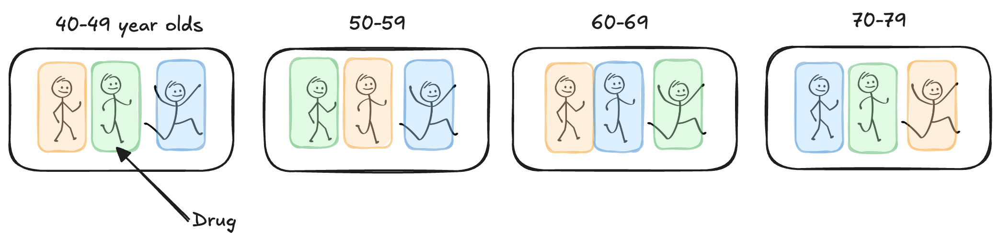
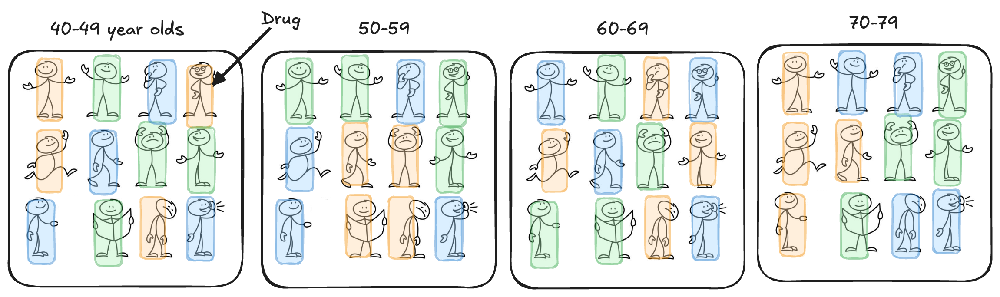
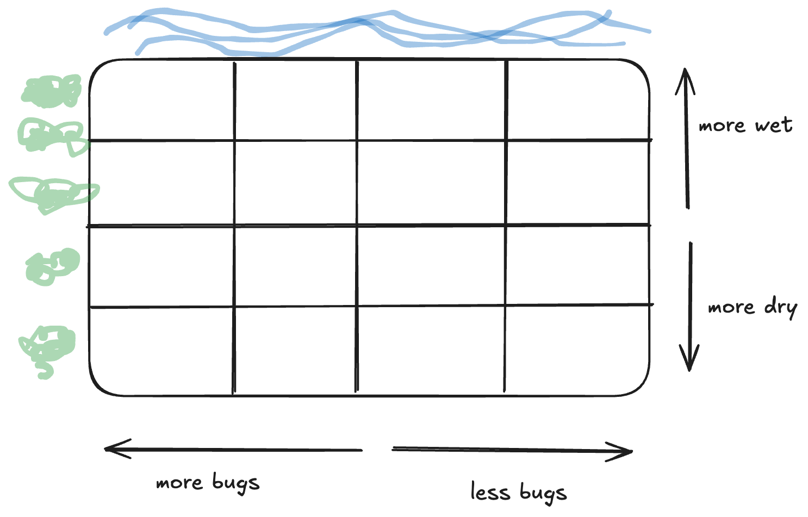
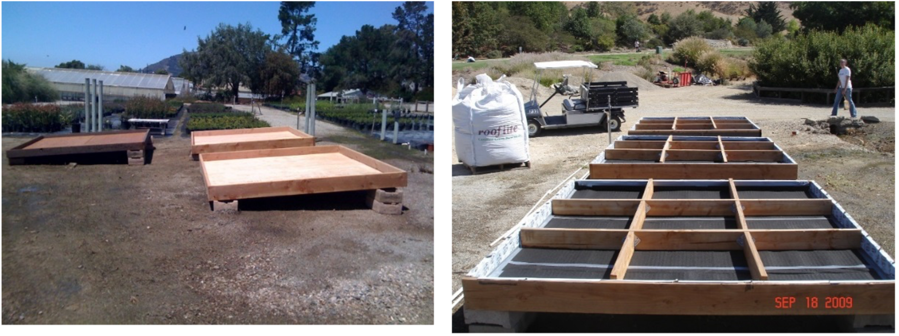
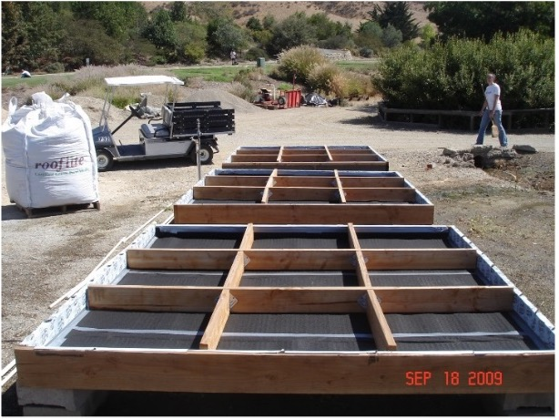
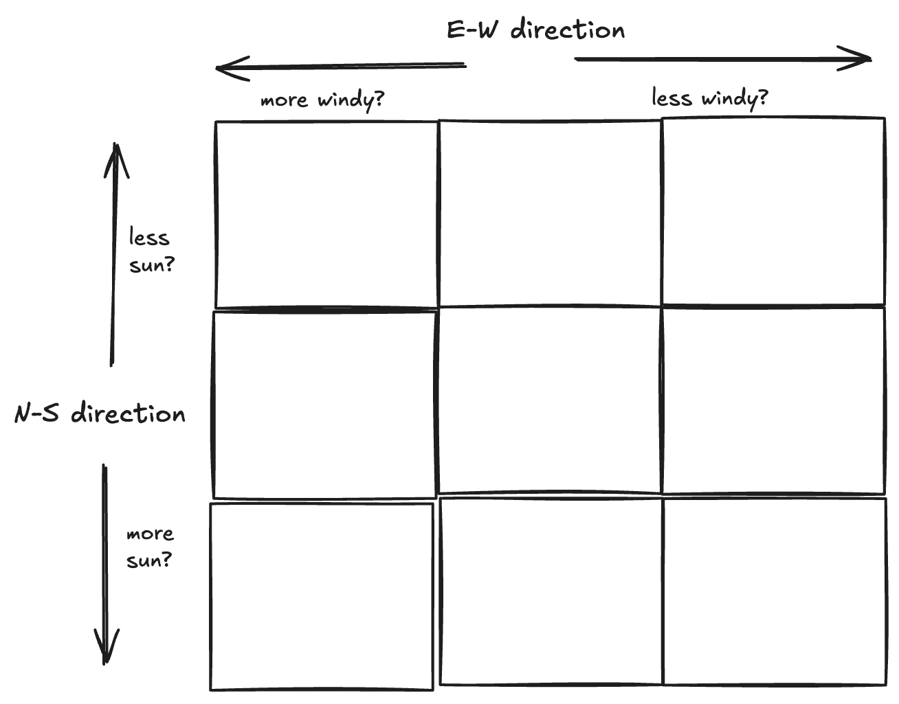
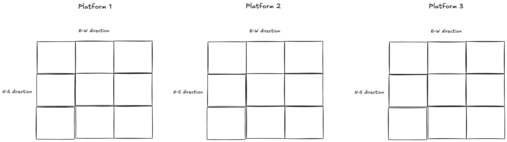
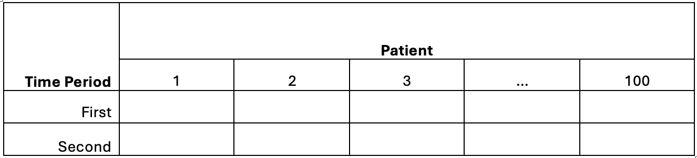

```{r}
#| label: setup

library(tidyverse)
library(multcomp)
library(emmeans)
```


# Generalized Block Designs

## Limitations of RCBD

```{=html}
<style>
.reveal .slides .small table { font-size: 0.78em; line-height:1.05; }
.reveal .slides .small table th, .reveal .slides .small table td { padding:6px 8px; }
</style>
```

-   In an R**C**BD, each treatment appears *once* per block
    -   limits ability to test treatment x block interaction
-   Blocks reduce unexplained variability

What if...

-   One experimental unit per treatment x block isn't enough?
-   We want to assess the treatment x block interaction?
-   Blocks represent real populations (clinics, regions)?

## Example 7.1: Cholesterol

::: {style="font-size:0.7em"}
> Suppose we wish to compare three drugs (Placebo, Atorvastatin, Rosuvastatin) on their effectiveness at controlling cholesterol (change, post - pre) in adults. We decide to block on age group to reduce variability, using age ranges (40-49, 50-59, 60-69, 70-79).

As a RCBD, one adult in each age group is assigned each of the 3 drug treatments:

```{r}
#| fig-align: center
#| out-width: 80%

```

-   Is one adult a good representation of all adults in that age range?
-   Can we tell if the drug works differently for older vs younger patients?
:::

## Solution: Replicate *within* block!

```{r}
#| fig-align: center
#| out-width: 80%

```

::: callout-note
### Generalized Block Design

is used when we want or need to replicate within the block. This allows us to compare blocks while still accounting for block-to-block variation and assessing potential interactions between treatments and blocks.
:::

## Study Design

**Treatment Structure** One-way with three levels of drug (Placebo, Atorvastatin, Rosuvastatin); t = 3.

**Experimental Structure** Drug is randomly assigned to four adults ($r_m = 4$) (e.u.) within four age groups (40-49, 50-59, 60-69, 70-79) ($M = 4$) in a generalized block design for total replications of $r = M\cdot r_m = 16$. The change in cholesterol (post - pre) is measured once for each adult (m.u.).

```{r}
#| echo: true
cholesterol_data <- read.csv("_data/07-cholesterol.csv") |> 
  janitor::clean_names()
head(cholesterol_data)
```

## Incorrect Analysis


:::: columns
::: {.column width=60%}

::: callout-warning
### Additive Model

$$y_{im} = \mu + \tau_i + \rho_m + \epsilon_{im}$$

```{r}
#| fig-align: center
#| out-width: 25%
#| echo: true
cholest_mod0 <- lm(cholesterol_change ~ drug + age_group, 
                   data = cholesterol_data)
anova(cholest_mod0)
```
:::

:::

::: {.column width=40%}

::: callout-warning
### Additive Model
```{r}
#| fig-align: center
#| out-width: 90%

cholest_mod0 |> 
  broom::augment() |> 
  ggplot(aes(x = .fitted, y = .resid)) +
  geom_point() +
  geom_hline(yintercept = 0,
             color = "#3a86d4") +
  labs(x = "Fitted Values", y = "Residuals")


```
:::
:::
::::

## Include block x treatment interaction


::::: columns
::: column

::: {style="font-size:0.7em"}
$$y_{imk} = \mu + \tau_i + \rho_m + \tau\rho_{im} + \epsilon_{imk}$$ 

$\text{ with } \epsilon_{imk} \overset{\text{ iid}}{\sim} N(0, \sigma^2)$

for $i = 1, 2, 3$, $m = 1, 2, 3, 4$, and $k = 1, 2, 3, 4.$
:::

:::

::: column
| Source of Variation | DF  |
|---------------------|-----|
|                     |     |
:::
:::::

## R: Include block x treatment interaction

:::: columns
::: {.column width=60%}
```{r}
#| fig-align: center
#| out-width: 40%
#| echo: true
cholest_mod1 <- lm(cholesterol_change ~ drug + age_group 
                   + drug:age_group, 
                   data = cholesterol_data)
anova(cholest_mod1)
```
:::
::: {.column width=40%}
```{r}
#| fig-align: center
#| out-width: 90%
#| code-fold: true

cholest_mod1 |> 
  broom::augment() |> 
  ggplot(aes(x = .fitted, y = .resid)) +
  geom_point() +
  geom_hline(yintercept = 0,
             color = "#3a86d4") +
  labs(x = "Fitted Values", y = "Residuals")

```

```{r}
#| fig-align: center
#| out-width: 90%
#| code-fold: true


cholest_mod1 |> 
  broom::augment() |> 
  ggpubr::ggqqplot(x = ".resid",
         color = "#3a86d4") +
  labs(title = "Normal QQ-Plot of Residuals")
```

:::
::::
## R: Example 7.1 Recommendations

:::: columns
::: {.column width=45%}
```{r}
#| echo: true
#| fig-align: center
#| fig-width: 8
#| fig-height: 5
#| out-width: 80%

# as a reminder, these functions are from the 
# emmeans and multcomp packages so 
# make sure you include 
# library(emmeans) and
# library(multcomp)
# in your script


emmip(cholest_mod1, drug ~ age_group, CI = T)
```
:::
::: {.column width=55%}
```{r}
#| echo: true
emmeans(cholest_mod1, ~ drug | age_group) |> 
  cld(Letters = LETTERS, decreasing = T,
      adjust = "tukey")
```
:::
::::

## Generalized Block Design vs Full Factorial

-   Design: randomly assign treatments *within* blocks (kind of like a bunch of CRDs)
-   Analysis: essentially the same as a full factorial ($\tau_i + \rho_m + \tau\rho_{im}$)

## Misleading Main Effects (ignoring interaction)

:::: columns
::: {.column width=45%}
```{r}
#| echo: true
#| fig-align: center
#| fig-width: 8
#| fig-height: 5
#| out-width: 80%
emmip(cholest_mod1, ~ drug, CI = T)
```
:::
::: {.column width=55%}
```{r}
#| echo: true
emmeans(cholest_mod1, ~ drug) |> 
  cld(Letters = LETTERS, decreasing = T, adjust = "tukey")
```
:::
::::

<!-- ## Example 7.2: Bone Anchors -->

<!-- > An experiment was conducted to compare the pull-out forces of three bone anchors: two standard anchors (A1 and A2) and one experimental anchor (E). Because bone quality can influence anchor performance, two types of synthetic foam were used to simulate different bone densities: high-density (HD) and low-density (LD) foam. -->

<!-- > -->

<!-- > Each anchor was tested in both foam types, and 8 independent tests were conducted for every anchor-foam combination. This design allowed the researchers to compare anchors fairly under both bone-like conditions, while also accounting for variation due to foam type. -->

<!-- ```{r} -->

<!-- #| fig-align: center -->

<!-- #| out-width: 80% -->

<!-- knitr::include_graphics("images/071-bone-anchor.png") -->

<!-- ``` -->

<!-- ## Example 7.1: Study Design -->

<!-- Would you want to treat form density as a fixed or random effect? -->


# Latin Square Design

## Why latin square designs?

```{=html}
<style>
.reveal .slides .small table { font-size: 0.78em; line-height:1.05; }
.reveal .slides .small table th, .reveal .slides .small table td { padding:6px 8px; }
</style>
```

::: {style="font-size:0.7em"}
-   RCBD blocks on one extraneous variable
-   Sometimes we need to account for two extraneous variables
-   Latin Square = rows + columns as blocks
:::

::: callout-note
### Field Design

```{r}
#| fig-align: center
#| out-width: 40%

```
:::

## Example 7.2: Green Roof

::: {style="font-size:0.7em"}
> A MS student in Horticulture at Cal Poly, carried out a study on green
> roof technology. The purpose of the study was to investigate the
> effectiveness of 3 different growing media (Freedom Square, FLL
> standard and High Organic Matter) for establishing sedum on rooftops.
> (Sedum is a type of flowering succulent.) Lots of research in this
> area is being done, because planting on rooftops can help with storm
> water management, energy conservation and reduction of the surrounding
> air temperature. The response was the coverage % of sedum after a
> period of 8-weeks of growing time.
>
> The study was carried out in a replicated (3 reps) Latin Square on the
> platforms (shown below). The platforms must be set at an angle to help
> with drainage, but there were concerns that location within a platform
> would have an effect on growth, both in the N-S and E-W directions. So
> each platform was partitioned into a 3x3 grid as shown below
:::

```{r}
#| fig-align: center
#| out-width: 37%

```

## Example 7.1: Green Roof

::::: columns
::: column
For one platform, identify..

-   Response variable:

-   Factor(s) & level(s):

-   Experimental unit:

-   Blocking variable 1:

-   Blocking variable 2:
:::

::: column
```{r}
#| fig-align: center
#| out-width: 80%

```
:::
:::::

## Latin Square Experimental Structure (Sudoku idea)

::::: columns
::: column
We implement a "restricted randomization"

If $t$ treatments

-   $t \times t$ grid
-   Each treatment appears *once* per row
-   and *once* per column
:::

::: column
```{r}
#| fig-align: center
#| out-width: 80%

```
:::
:::::

## The Data: One Platform

```{r}
#| echo: true

# read in data, and convert all variables that 
# should be categorical to factor types!

greenroof_data <- read_csv("_data/07-green_roof_data.csv") |> 
  janitor::clean_names() |> 
  mutate(across(platform_replicate:growing_media, as.factor))
```

```{r}
#| echo: true
#| eval: false

# look at data just for platform replicate 1
greenroof_data_platform1 <- greenroof_data |> 
  filter(platform_replicate == 1)
greenroof_data_platform1
```

```{r}
#| echo: false
#| eval: true

# save and look at data just for platform replicate 1
greenroof_data_platform1 <- greenroof_data |> 
  filter(platform_replicate == 1)
greenroof_data_platform1 |> 
  knitr::kable() |> 
  kableExtra::scroll_box(height = "300px") |> 
  kableExtra::kable_styling(font_size = 25)
```

## Statistical Effects Model (One Platform)

::: {style="font-size:0.7em"}
$$y_{ijk}=\mu + \tau_i + r_j + c_k + \epsilon_{ijk} \text{ with } \epsilon_{ijk} \text{ iid} \sim N(0,\sigma^2)$$

For $i=1,2,3;   j=1,2,3; k=1,2,3$

where:

-   $y_{ijk}$: % of sedum for the $k^{th}$ platform column (E-W) in the
    $j^{th}$ platform row (N-S) given the $i^{th}$ growing media. +
    $\mu$: overall mean % sedum
-   $\tau_i$: effect of the $i^{th}$ level of growing media
-   $r_j$: effect of the $j^{th}$ level of platform row (N-S direction)
-   $c_k$: effect of the $k^{th}$ level of platform column (E-W
    direction)
-   $\epsilon_{ijk}$: experimental error for the $k^{th}$ platform
    column (E-W) in the $j^{th}$ platform row (N-S) given the $i^{th}$
    growing media.
:::

## ANOVA (One Platform) {.small}

| Source of Variation              | DF               | SS    | MS    | F         |
|-------------------------|------------|------------|------------|------------|
| Rows\*                           | rows - 1         | SSrow | MSrow | MSrow/MSE |
| Columns\*                        | cols - 1         | SScol | MScol | MScol/MSE |
| Treatment                        | t - 1            | SSTrt | MSTrt | MSTrt/MSE |
| Rows x Cols x Treatments — error | Use subtraction! | SSE   | MSE   |           |
| Total                            | N - 1            |       |       |           |

\*Note: in only one Latin Square replicate, the number of row blocks and
column blocks are equal to the number of treatments (i.e., rows = cols =
t)

## Skeleton ANOVA (One Platform)

| Source of Variation | DF: 3 rows x 3 columns = 9 e.u - 1 = 8 total |
|---------------------|----------------------------------------------|
|                     |                                              |

## R: Analysis (One Platform) -- Estimated Coefficients

```{r}
#| echo: true
greenroof_mod1 <- lm(coverage_pct ~ growing_media + ns_position + ew_position,
                     data = greenroof_data_platform1)
summary(greenroof_mod1)
```

## R: Analysis (One Platform) -- ANOVA

```{r}
#| echo: true
anova(greenroof_mod1)
```


## Replicating a Latin Square

::: callout-note
### Why Replicate?

Replication increases the error degrees of freedom, **improving** the
**precision** of estimates $\rightarrow$ **increases** statistical **power**.

In a Latin Square design, replication can be achieved in several ways:

-   Replicate rows (e.g., adding more North-South blocks)
-   Replicate columns (e.g., adding more East-West blocks)
-   Replicate entire squares (e.g., adding more experimental platforms
    or study sites
:::

## Example 7.2: Replicated Latin Square Structure

::: {style="font-size:0.7em"}
Blocking to account for:

-   Platform = Global Block
-   N-S Direction *within* each Platform
-   E-W Direction *within* each Platform
:::

```{r}
#| fig-align: center
#| out-width: 100%

```


## Statistical Effects Model (Three Platforms)

::: {style="font-size:0.7em"}
$$y_{ijkl}=\mu+\tau_i+\rho_m+ r(\rho)_{mk}+c(\rho)_{ml}+\epsilon_{imkl} \text{ with } \epsilon_{imk} \text{ iid}\sim N(0,\sigma^2 )$$

For $i=1,2,3;   m=1,2,3;    k=1,2,3;    l=1,2,3$

where:

-   $y_{ijkl}$: % of sedum for the $m^{th}$ platform in the $l^{th}$
    platform column (E-W) in the $k^{th}$ platform row (N-S) given the
    $i^{th}$ growing media.
-   $\mu$: overall mean % sedum
-   $\tau_i$: effect of the $i^{th}$ level of growing media
-   $\rho_j$: effect of the $m^{th}$ platform
-   $r(\rho)_{mk}$: effect of the $k^{th}$ level of platform row (N-S
    direction) within the $m^{th}$ platform
-   $c(\rho)_{ml}$: effect of the $l^{th}$ level of platform column (E-W
    direction) within $m^{th}$ platform
-   $\epsilon_{imkl}$: experimental error for the $j^{th}$ platform in
    the $l^{th}$ platform column (E-W) in the $k^{th}$ platform row
    (N-S) given the $i^{th}$ growing media.
:::

## ANOVA (Three Platforms) {.small}

| Source of Variation     | DF                   | SS    | MS    | F         |
|-------------------------|----------------------|-------|-------|-----------|
| Global Block            | blks - 1             | SSblk | MSblk | MSblk/MSE |
| Rows(Global Block)\*    | (rows - 1)(blks) | SSrow | MSrow | MSrow/MSE |
| Columns(Global Block)\* | (cols - 1)(blks) | SScol | MScol | MScol/MSE |
| Treatment               | t - 1                | SSTrt | MSTrt | MSTrt/MSE |
| Error                   | Use subtraction!     | SSE   | MSE   |           |
| Total                   | N - 1                |       |       |           |

## Skeleton ANOVA (Three Platforms)

| Source of Variation | DF: 3 rows x 3 columns = 9 e.u - 1 = 8 total |
|---------------------|----------------------------------------------|
|                     |                                              |

## R: Analysis (Three Platforms) -- Estimated Coefficients


```{r}
#| echo: true
greenroof_mod2 <- lm(coverage_pct ~ growing_media + platform_replicate + 
                       platform_replicate/ns_position + platform_replicate/ew_position,
                     data = greenroof_data)
summary(greenroof_mod2)
```

## R: Analysis (Three Platforms) -- ANOVA


```{r}
#| echo: true
anova(greenroof_mod2)
```


## Results (Three Platforms)

::::: columns
::: {.column width=42%}
```{r}
#| fig-align: center
#| out-width: 90%
#| fig-height: 5
#| fig-width: 5
#| echo: true

emmip(greenroof_mod2, ~ growing_media, 
      CI = T)
```

:::
::: {.column width=58%}

```{r}
#| fig-align: center
#| out-width: 90%
#| fig-height: 5
#| fig-width: 8
#| echo: true
emmeans(greenroof_mod2, ~ growing_media) |> 
  cld(Letters = LETTERS, 
      decreasing = T, 
      adjust = "tukey")
```
:::

:::::

## Random Effects in a Latin Square

Treat blocks as random when:

+ blocks represent a larger population
+ you don’t care about specific blocks
+ you want broader inference

## Crossover Designs

::: callout-note
Crossover designs are one of the most common *applications* of Latin Square experimental structures. In these designs, each subject receives multiple treatments over different time periods, serving as their own block.

+ Repeated Measures Structure: Each subject is exposed to multiple treatments.
+ Latin Square Application: A structured way to balance treatment order across subjects.
+ Washout Periods: Time between treatments to eliminate carryover effects.
+ Multiple Subjects Per Sequence: Ensures treatment comparisons are not biased by order effects.
:::

## Example 7.3: Clinical Trial

::: {style="font-size:0.7em"}

> Suppose we have 2 medications (new medication, N vs. standard medication, S). Patients are recruited (100 patients) into the study. Each patient receives one of the medications for the first period of time. Then, each patient, crosses over to the other medication during a second time period. Patients are randomly assigned to one of the possible sequences: NS or SN
> 
> Typically, there will be a washout period between the treatments so that medication that was assigned in the first time period has time to clear out of the patient’s body before they begin on the second medication.
:::


```{r}
#| fig-align: center
#| out-width: 70%

```

## Key Conditions for a Crossover

:::: columns
::: column
Works best when:

+ condition is chronic/stable
+ treatment is not curative
+ washout removes carryover
:::
::: column
Threats:

+ short washout period leading to carryover effects
+ period effects
+ treatment alters future response
:::
::::

