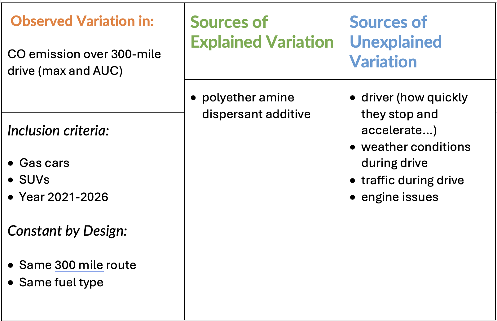

::: callout-note
Submit via Gradescope.

I would recommend using the Word template.
:::

# 1. Scenario: Sources of Variation

Researchers are studying the effect of a polyether amine dispersant additive on carbon monoxide (CO) emissions in gasoline-powered vehicles under non-laboratory driving conditions.

Twenty vehicles from a variety of manufacturers are used in the study. Five additive levels (2%, 3%, 4%, 5%, and 6%) are considered. Each additive level is randomly assigned to four vehicles, resulting in a balanced design.

For each vehicle, 16 ounces of the assigned additive are added to the fuel tank. A sensor attached to each vehicle measures CO emissions in the exhaust every 5 seconds while the vehicle is driven for 300 miles.

The primary outcomes of interest are computed for each vehicle and include:

- the maximum CO emission (a single number), and
- the area under the CO emission curve (AUC) over the 300-mile drive (a single number).

## a. Sketch a Design Blueprint

\vspace{1in}

*Include image of sketch here*

## b. Describe the following:

- Treatment structure

\vspace{0.7in}

- Design structure

\vspace{0.7in}

- Response variable(s)

\vspace{0.5in}

::: version-solution
- Treatment structure

  - Name: one way
  - Factor: (%) of polyether amine dispersant additive
  - Levels: 2%, 3%, 4%, 5%, and 6%
  - t = 5

- Design structure

  - Randomization: CRD
  - e.u.: one vehicle
  - r = 4
  - m.u.= one vehicle
  - N = n = 20

- Response variable(s)

  - maximum CO emission (a single number) over the 300-mile drive
  - the area under the CO emission curve (AUC) over the 300-mile drive.
  
:::

## c. Inclusion Criteria

To reduce variability in CO emissions that is unrelated to the additive, researchers may restrict which vehicles are eligible for the study. Provide **two reasonable inclusion criteria** for the experimental units (vehicles) that could reduce variability in the response.

::: version-instructions
\vspace{0.8in}
:::

::: version-solution
- Year 2021-2026
- Less than 100k miles
- Same model (e.g., SUV)
- Only gas cars
:::

## d. Statistical Limitation of Inclusion Criteria

Explain, in the context of this study, one statistical limitation of using strict inclusion criteria such as those described in the previous question. Your explanation should address how inclusion criteria affect the interpretation or scope of the study results.

::: version-instructions
\vspace{0.8in}
:::

::: version-solution
*Using too strict of inclusion criteria will limit what/who your results can apply to. If you only choose Toyota camrys to be in your study, then that is the only car you can generalize your results to!*
:::

## e. Other Sources of Variability

Besides variability introduced by differences between vehicles, describe **two other sources of variability** in CO emissions that could reasonably be controlled or standardized during this study. Briefly explain how each source could be controlled.

::: version-instructions
\vspace{0.8in}
:::

::: version-solution
- the route
  - type of road (freeway, gravel, city..)
  - the terrain (hilly, flat)
- fuel type
- driver
:::

## f. Sources of Variability Table

Fill out a sources of variability table (see 1.2 slides), summarizing your answers to c and e (plus the response variable from b). Add some potential sources of unexplained variation in the response.

::: version-instructions
*Include table here*
:::

::: version-solution

:::

## g. Reflection

Suppose the researchers use very strict inclusion criteria so that all vehicles in the study are nearly identical.

Briefly discuss how this choice would affect:

- variability in the response,
- the ability to detect differences among additive levels, and
- the generalizability of the study conclusions.

\vspace{0.8in}

::: version-solution

*If all vehicles are nearly identical then, there would presumably be very little variability in the response -- CO that isn't due to the explained variability from the additive level. This would make it easier todetect differences among additive levels. However, the study would only be generalized to that exact kind of car, so the results are not necessarily that useful.*

:::

# 2 Scenario: Observational Study vs Designed Experiment

The following was the headline for an article published on *ScienceDaily* (January 4, 2016):

> **“People who have a higher sense of purpose in life are at lower risk of death and death from a cardiovascular event.”**\
> (*Psychosomatic Medicine: Journal of Biobehavioral Medicine*)

The article in science daily was referencing a study[^1] which reported that 136,000 subjects (average age 67) were followed for an average of 7 years. During that time, 14,500 participants died from any cause and 4,000 died from a cardiovascular event.

[^1]: Cohen R, Bavishi C, Rozanski A. Purpose in life and its relationship to all-cause mortality and cardiovascular events: a meta-analysis. Psychosom Med. 2016;78:122–33.

At the beginning of the study period, participants completed a questionnaire designed to measure their sense of purpose in life. Individuals were then classified as having either a low or high sense of purpose.

Depending on how it is read, the headline could be interpreted as suggesting that a higher sense of purpose *causes* a lower risk of death. However, the study design does not support a causal conclusion.

## a. Extraneous Variables

List **three extraneous variables** that may influence whether a person dies from a cardiovascular event.

> *Note:* Sense of purpose is **not** an extraneous variable in this study, it is the explanatory variable.

\vspace{0.8in}

::: version-solution
- genetics
- whether they smoke
- how much physical activity they engage in
- age
:::

## b. Confounding

Choose **one** extraneous variable from part (b) and explain how it could act as a **confounding variable** in this study.

Your explanation should clearly describe how this variable is related to:

- sense of purpose, and
- cardiovascular mortality.

\vspace{0.8in}

::: version-solution

*We know that genetics influences people's mental health conditions, so reasonably sense of purpose could be related to genetics in some way. We also know that propensity for certain diseases is related to genetics, so cardiovascular mortality may be related to genetics in some way.*

:::

## c. Why an Experiment Is Not Feasible

Suppose researchers wanted to design an experiment to support the causal claim:

> “A higher sense of purpose causes a lower risk of cardiovascular death.”

Explain why designing such an experiment is *practically impossible*.

::: version-solution

*You clearly cannot manipulate the treatment -- a person's sense of purpose (even if you could think of a way, it would absolutely not be ethical!).*
:::
